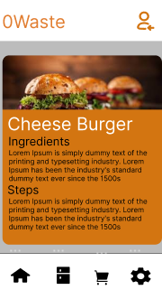
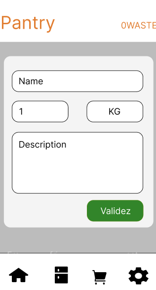
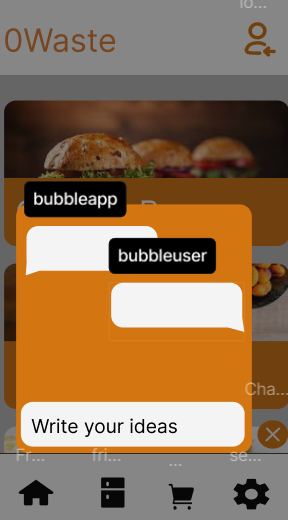
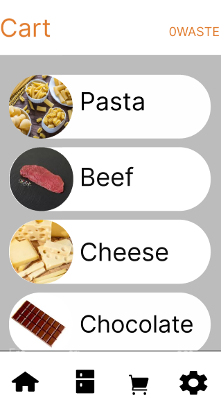
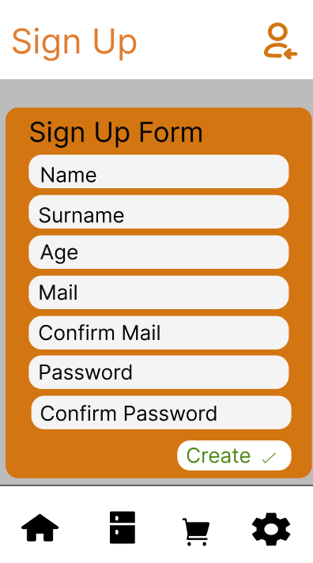

# 📄 Written Report by Alexandre Bopp

- [📄 Written Report by Alexandre Bopp](#-written-report-by-alexandre-bopp)
  - [What is my project?](#what-is-my-project)
    - [1. My idea](#1-my-idea)
  - [Glossary](#glossary)
  - [Functional Part](#functional-part)
    - [1 Team \& Roles](#1-team--roles)
    - [2. Requirements](#2-requirements)
      - [2.1 Core Requirements](#21-core-requirements)
        - [a. Recipe Selection \& Meal Planning](#a-recipe-selection--meal-planning)
        - [b. Pantry Inventory Management](#b-pantry-inventory-management)
        - [c. Intelligent Recipe Suggestions via Chatbot](#c-intelligent-recipe-suggestions-via-chatbot)
        - [d. Recipe Access \& Cooking Guidance](#d-recipe-access--cooking-guidance)
      - [2.2 Deliverables](#22-deliverables)
      - [2.3 Functional Requirements](#23-functional-requirements)
      - [2.4 Non Functional Requirements](#24-non-functional-requirements)
    - [3. App Mockups](#3-app-mockups)
      - [3.1 Main App Interface](#31-main-app-interface)
      - [3.2 Recipe Details \& Cooking Steps](#32-recipe-details--cooking-steps)
      - [3.3 Pantry Inventory System](#33-pantry-inventory-system)
      - [3.4 Integrated Chatbot](#34-integrated-chatbot)
      - [3.5 Shopping Cart](#35-shopping-cart)
      - [3.6 Login \& Signup](#36-login--signup)
    - [4. Context](#4-context)
      - [4.1 Personas](#41-personas)
        - [Persona 1: Eco-Conscious Emily](#persona-1-eco-conscious-emily)
        - [Persona 2: Budget-Conscious Bob](#persona-2-budget-conscious-bob)
      - [4.2 Use Cases](#42-use-cases)
    - [5. Risk](#5-risk)
      - [5.1 Data Security \& Integrity](#51-data-security--integrity)
      - [5.2 Risk Assessment](#52-risk-assessment)
      - [5.3 Context \& Related Solutions](#53-context--related-solutions)
      - [5.4 Project Risk Management Strategy](#54-project-risk-management-strategy)
  - [Technical Part](#technical-part)
    - [1. System Architecture](#1-system-architecture)
      - [1.1 Technology Stack](#11-technology-stack)
      - [1.2 Firebase Firestore Structure](#12-firebase-firestore-structure)
      - [1.3 Flow Diagrams](#13-flow-diagrams)
        - [a. Auth Flow](#a-auth-flow)
        - [b. Inventory Flow](#b-inventory-flow)
        - [c. Recipe Chatbot Flow](#c-recipe-chatbot-flow)
          - [Understanding How A Chatbot Works](#understanding-how-a-chatbot-works)
          - [Basic Chatbot Flow](#basic-chatbot-flow)
      - [1.4 Data Persistence](#14-data-persistence)
      - [1.5 Deployment](#15-deployment)
        - [a. Mobile Deployment Strategy](#a-mobile-deployment-strategy)
        - [b. Why Capacitor](#b-why-capacitor)
        - [c. Steps to Deploy on Android with Capacitor](#c-steps-to-deploy-on-android-with-capacitor)
      - [1.6 API](#16-api)
        - [a. Spoonacular API](#a-spoonacular-api)
        - [b. Spoonacular Workflow \& Code](#b-spoonacular-workflow--code)
      - [Example Code](#example-code)
  - [Management \& Workflow](#management--workflow)
    - [How did I Organize My Work?](#how-did-i-organize-my-work)
  - [🧪 Test Plan](#-test-plan)
    - [1. Local Testing with Hardcoded Data](#1-local-testing-with-hardcoded-data)
    - [2. Real-Time API Integration (Spoonacular)](#2-real-time-api-integration-spoonacular)
    - [3. API Rate Limit Testing](#3-api-rate-limit-testing)
    - [4. Responsiveness Testing](#4-responsiveness-testing)
    - [5. What I Didn't Test](#5-what-i-didnt-test)
    - [6. Summary](#6-summary)
  - [Future Improvements](#future-improvements)

## What is my project?

My project's name is **0waste**. It’s a mobile-first web application designed to reduce food waste by helping people manage their kitchen inventory more efficiently.

The idea came from personal experience. Even within my own family, I’ve noticed how easy it is to overbuy products simply because we don’t remember what we already have at home. For example, you might be shopping and feel like eating something with mozzarella, but you're unsure whether there’s any left at home so you buy more. Suddenly, you end up with two packs for a one-time meal. Sure, I’d probably eat both, but many people wouldn’t—and that’s where food waste starts.

### 1. My idea

I wanted to create a tool that follows users throughout their grocery shopping, helping them make informed decisions and avoid buying unnecessary items.

The app combines forth key features:

- **A digital pantry** that tracks what you currently have.
- **A shopping cart** to prepare before going to the store.
- **A recipe suggestion tool** that shows you what you can cook with the ingredients you already own.
- **A chatbot assitant** to help you to find ideas with your ingredients.

It’s meant to be easy to use, intuitive, and efficient.

---

## Glossary

| **Term**                      | **Definition**                                                                                                                                                |
| ----------------------------- | ------------------------------------------------------------------------------------------------------------------------------------------------------------- |
| **React**                     | A JavaScript library used to build dynamic and responsive user interfaces. In this project, it structures and renders the entire frontend of the application. |
| **Vite**                      | A frontend build tool that enables fast development and optimized builds for production. Used here to accelerate development speed.                           |
| **Tailwind CSS**              | A utility-first CSS framework that allows rapid styling via class names. Used to build a consistent, responsive UI efficiently.                               |
| **Firebase**                  | A Backend-as-a-Service platform providing tools like Firestore, Auth, and Hosting. Used here to manage users and store their inventory.                       |
| **Firebase Auth**             | A secure authentication system included in Firebase. Used to handle sign-in and user identity validation.                                                     |
| **Firestore**                 | A NoSQL real-time database by Firebase. Stores user-specific data like inventory, recipes, and shopping lists.                                                |
| **Capacitor**                 | A tool to convert web applications into native mobile apps for Android and iOS. Used to plan mobile deployment without rewriting the app.                     |
| **Spoonacular API**           | A third-party REST API for food and recipes. Used to fetch recipe suggestions based on user inventory.                                                        |
| **Chatbot (Non-AI)**          | A rule-based conversational system that interprets user input using keywords. In this app, it suggests recipes based on messages.                             |
| **LocalStorage**              | A simpler browser-based storage mechanism for saving temporary data like user preferences or cache.                                                           |
| **Authentication**            | The act of verifying a user's identity. Ensures that only logged-in users access and sync data.                                                               |
| **UID (User ID)**             | A unique identifier assigned to each authenticated Firebase user. Used to isolate data per user in Firestore.                                                 |
| **CRUD**                      | Stands for Create, Read, Update, Delete. Refers to the fundamental operations on data, such as managing pantry items.                                         |
| **Trello**                    | A task management tool using cards and lists. Used to plan and track progress during the development cycle.                                                   |
| **Mockups**                   | Visual representations of what the app will look like. Created before development to validate design ideas.                                                   |
| **Functional Specs**          | Describes what the application should do from a user perspective. Used to guide the development process.                                                      |
| **Technical Specs**           | Details how the app is built, including frameworks, data models, and system architecture.                                                                     |
| **API Rate Limiting**         | A restriction imposed by APIs like Spoonacular to limit the number of requests. Requires careful call management.                                             |
| **Mermaid.js**                | A tool to create flowcharts and diagrams in Markdown. Used to visualize app logic and architecture in the documentation.                                      |

## Functional Part

### 1 Team & Roles

All the roles will be handle by myself.

| **Role**             | **Description**                                                                                                                                           |
|----------------------|-----------------------------------------------------------------------------------------------------------------------------------------------------------|
| **Project Manager**  | Oversees planning, organization, and budgeting. Ensures the team stays on track and motivated.                                                            |
| **Program Manager**  | Defines project goals and ensures alignment with expectations. Leads design efforts and authors the Functional Specifications document.                  |
| **Technical Leader** | Drives technical decisions, translates Functional Specifications into Technical Specifications, reviews code, and provides guidance throughout development. |
| **Technical Writer** | Develops and maintains documentation, including user manuals and technical guides. Collaborates with engineers to ensure clarity and accuracy.             |
| **Software Engineer**| Implements features through coding, participates in technical design discussions, and contributes to maintaining up-to-date documentation.                |
| **Quality Assurance**| Tests features to identify bugs and inconsistencies, documents issues, verifies fixes, and develops/executestest plans.                                     |

---

### 2. Requirements

#### 2.1 Core Requirements

##### a. Recipe Selection & Meal Planning

- **User Input:**  
  - Users can browse and select recipes from a curated database.
  - Option to specify the number of servings per recipe.
- **Automated Shopping List:**  
  - The app calculates the exact quantities of ingredients required based on the selected recipe and specified servings.
  - Automatically generates and updates the shopping cart with the required items.

*Example:*  
A user selects a lasagna recipe for four servings; the application computes the precise amounts of each ingredient and adds them to the shopping list.


##### b. Pantry Inventory Management

- **Product Addition:**  
  - Users can manually add items they already have in their pantry, including quantity and (optionally) expiration dates. This helps in keeping track of the food they have and prevents over-purchasing.
  
- **Smart Shopping Cart:**  
  - The system cross-references pantry items with the recipe requirements. This ensures that ingredients that are already in stock are not added to the shopping list, saving time and money.
  - Omits ingredients already available, preventing duplicate purchases and optimizing shopping.

*Example:*  
If a recipe requires 200g of pasta and the user has 100g in stock, the shopping list is adjusted to add only the additional 100g required.


##### c. Intelligent Recipe Suggestions via Chatbot

- **User Interaction:**  
  - A chatbot interacts with users to help them find recipes based on available ingredients or specific preferences. It can understand natural language and suggest recipes accordingly.
  
- **Conversational Guidance:**  
  - The chatbot refines search criteria through dialogue. It can ask follow-up questions like "Do you prefer vegetarian recipes?" or "Do you have any dietary restrictions?" to suggest appropriate recipes.

*Example:*  
A user mentions they have salmon but isn’t sure how to prepare it. The chatbot will propose several salmon-based recipes and allow the user to choose one.


##### d. Recipe Access & Cooking Guidance

- **Digital Cookbook**
  - Provides users with detailed, step-by-step instructions for selected recipes. Users can follow each cooking stage at their own pace, with the ability to go back or forward as needed.

    - To power this feature, the application integrates with the Spoonacular API.

    - Spoonacular is a comprehensive food and recipe database that allows developers to fetch:

    - Recipes with instructions

    - Ingredients and quantities

    - Nutritional information

    - Dietary tags (e.g., vegetarian, gluten-free)

    - Meal planning options

  - By sending HTTP requests to Spoonacular’s endpoints, the app dynamically retrieves the relevant recipe content based on user preferences or chatbot suggestions.
  


- **Ingredient Tracking:**  
  - Highlights which ingredients are already available in the user's pantry versus those that need to be purchased, ensuring the user knows exactly what to buy.

*Example:*  
After selecting a recipe, the user can view comprehensive cooking instructions and clearly identify which ingredients to buy based on what they already have in their pantry.


#### 2.2 Deliverables

| **Deliverable**             | **Description**                                                      |
|-----------------------------|----------------------------------------------------------------------|
| Functional Specifications   | Detailed document outlining the functional requirements              |
| Technical Specifications    | Document detailing technical implementation plans                    |
| Test Plan                   | Comprehensive plan for testing all application features              |
| Test Cases                  | Specific test cases to validate functionality                        |
| Code Repository             | Source code for the application                                      |
| User Manual                 | Documentation for end-users including tutorials and guides           |

Only three of them are available for the rncp6

---

#### 2.3 Functional Requirements

- **User Interaction Flows:**  
  Detailed workflows for recipe selection, pantry management, and chatbot interactions. This section outlines the paths users will take when using the app, ensuring an intuitive flow.
  
- **Data Processing:**  
  Accurate calculation of ingredient quantities and automated shopping list generation based on user input and existing pantry inventory. The system processes data efficiently to give accurate results quickly.

- **System Integration:**  
  Seamless coordination between the recipe database, inventory management system, and chatbot module to deliver a cohesive user experience. All components should work together smoothly to avoid confusion or disruptions.


#### 2.4 Non Functional Requirements

- **Performance:**  
  The application must generate shopping lists and update inventories in real time with minimal latency. Users should not experience delays when adding items or selecting recipes.

- **Scalability:**  
  The system should efficiently handle an increasing number of recipes and pantry entries without degradation in performance. As the app grows, it should be able to accommodate new features and additional users without issues.

- **Usability:**  
  The user interface must be intuitive and accessible to a wide range of users, ensuring a smooth and engaging experience. This includes support for accessibility features (e.g., text-to-speech, high-contrast mode).

- **Security:**  
  Although minimal sensitive data is handled, secure authentication (with firebase) and robust data integrity measures must be enforced to protect user data.
  - Using a login page to access to your datas.

- **Compatibility:**  
  The application must work on modern web browsers and be responsive to different screen sizes, ensuring accessibility across various devices (e.g., smartphones, tablets, desktops).

- **Reliability:**  
  The system should maintain high availability and consistently process user inputs accurately, even under load. This ensures that users can rely on the application without disruptions.


---

### 3. App Mockups

#### 3.1 Main App Interface


The only difference between these two screens is the icon in the top-right corner, which indicates whether the user is logged in. Clicking on the icon redirects the user to the login or signup pages. Once logged in, the user is redirected back to the main page, and the icon updates accordingly.

#### 3.2 Recipe Details & Cooking Steps



Clicking the button on the main page takes the user to this recipe detail page, which includes the steps for preparing the dish.

#### 3.3 Pantry Inventory System




This feature allows users to create and register ingredients. When a recipe is added to the cart, the app checks the pantry to avoid adding ingredients the user already has—helping reduce waste.

#### 3.4 Integrated Chatbot


If users have ingredients but don’t know what to cook, they can ask the integrated chatbot. It will suggest recipes based on the available ingredients.

#### 3.5 Shopping Cart



This screen displays the ingredients required for the recipes the user has selected.

#### 3.6 Login & Signup




These pages allow users to log in or sign up. Initially, the app can be used without logging in, but in the final version, login will be required. This will be managed using Firebase or a similar service.

### 4. Context

#### 4.1 Personas

##### Persona 1: Eco-Conscious Emily


- **Role:** Home Cook & Sustainability Advocate  
- **Age:** 30  
- **Background:** Emily is passionate about reducing her environmental impact and practices sustainable living. She is always looking for ways to minimize waste and optimize her food consumption.  
- **Needs:**  
  - A tool to plan meals based on her existing pantry items.  
  - Notifications for food nearing expiration.  
  - Suggestions for recipes that help reduce waste and promote sustainability.
- **Goals:**  
  - To save money by using what she already has.  
  - To reduce food waste and lower her carbon footprint.

##### Persona 2: Budget-Conscious Bob


- **Role:** Student & Part-Time Worker  
- **Age:** 22  
- **Background:** Bob is on a tight budget and often struggles with food expenses. He wants to avoid overbuying and make the most out of his grocery shopping.  
- **Needs:**  
  - A smart shopping list that adjusts based on his pantry inventory.  
  - Recipe suggestions that are both affordable and efficient.
- **Goals:**  
  - To stick to a budget by preventing unnecessary purchases.  
  - To reduce waste by planning meals with the food he already owns.

#### 4.2 Use Cases

| **Use Case**                             | **Description**                                                                                          | **Actor**                     |
|------------------------------------------|----------------------------------------------------------------------------------------------------------|-------------------------------|
| **Meal Planning & Recipe Selection**     | The user selects a recipe and specifies the number of servings; the app generates an accurate shopping list. | Eco-Conscious Emily, Budget-Conscious Bob |
| **Inventory-Based Shopping List**        | The user adds their pantry items, and the system adjusts the shopping list by removing items already available. | Eco-Conscious Emily, Budget-Conscious Bob |
| **Chatbot Recipe Assistance**            | The user interacts with a chatbot to find recipes based on ingredients they have or specific cravings.      | Eco-Conscious Emily           |
| **Expiration Date Notifications**        | The system sends alerts when items in the pantry are nearing their expiration date, suggesting relevant recipes. | Eco-Conscious Emily, Budget-Conscious Bob |
| **Discount & Loyalty Integration**       | The app alerts the user about discounted ingredients at partnered stores and integrates loyalty rewards.    | Budget-Conscious Bob          |
| **Community Food Sharing**               | Users can offer surplus food to nearby app members, fostering community support and reducing waste.        | Eco-Conscious Emily           |

---

### 5. Risk

#### 5.1 Data Security & Integrity

- **Authentication:**  
  - Optional sign-in, is implemented to control access, even though the application primarily manages non-sensitive food ingredient data.  
  - Should the scope expand to include sensitive information (e.g., card details), enhanced authentication and security protocols will be introduced.

- **Data Sensitivity:**  
  - The application primarily handles data related to food ingredients, recipes, and inventory, which are not inherently sensitive.
  - In the event that sensitive data is integrated, such as payment information, robust encryption and secure data storage practices will be enforced.

- **Precision & Relevance:**  
  - The system is engineered to prioritize accurate calculations and reliable data management.
  - Comprehensive validation measures and quality checks ensure that the application delivers precise results.

- **Security Best Practices:**  
  - Despite its internal use, industry-standard security measures will be adopted to maintain data integrity and support potential future enhancements.

#### 5.2 Risk Assessment

| **Risk**                                          | **Likelihood** | **Impact** | **Mitigation Strategy**                                                                         |
| ------------------------------------------------- | -------------- | ---------- | ----------------------------------------------------------------------------------------------- |
| Over-purchasing due to inaccurate calculations    | Medium         | High       | Test inventory comparison logic with real data and edge cases.                                  |
| Poor integration with external discount systems   | Medium         | Medium     | If implemented, ensure external APIs are monitored and fallback options exist.                  |
| Inaccurate AI recognition in inventory management | High           | High       | Replace unreliable AI parts with user-controlled validation until a better system is developed. |
| User adoption challenges due to complex UI        | Medium         | Medium     | Focus on a minimalist, intuitive design and provide tutorials based on user testing.            |
| Data loss in inventory records                    | Low            | High       | Implement backup strategies and validate write operations before syncing.                       |

#### 5.3 Context & Related Solutions

Several applications currently help reduce food waste, but each targets different aspects of the problem:

- **Too Good To Go** – Connects users with businesses offering unsold surplus food.
- **Karma** – Enables restaurants and stores to sell leftover meals.
- **Olio** – Facilitates food sharing between neighbors and communities.
- **Jow** – Offers recipe suggestions and generates shopping lists.

**Unlike these services, 0waste focuses specifically on household inventory management.** It emphasizes real-time syncing between pantry, shopping lists, and recipe suggestions—based entirely on what the user already has.

This context helps clarify 0waste’s position: it's not a platform for external deals or donations, but a personal planning tool for individuals or families.

#### 5.4 Project Risk Management Strategy

- **Risk Identification:**
  During development, potential risks were listed early—especially those related to data syncing, UX design complexity, and limitations of third-party services.

- **Risk Analysis:**
  Each risk was evaluated on its likelihood and potential impact. Critical issues like AI reliability and data accuracy were prioritized.

- **Risk Mitigation Measures:**

  - *Technical:* Focus on testable logic instead of early AI features; ensure all API requests are wrapped in error handling.
  - *User Experience:* Prioritize UI clarity and reduce cognitive load. Include helper text or guidance inside the interface.
  - *Data Handling:* Avoid storing sensitive user data. Use Firebase authentication and Firestore rules to enforce user-level isolation.

- **Monitoring:**
  User feedback and manual testing were used to monitor pain points. Improvements were applied iteratively during feature development.

- **Fallback & Recovery:**
  In the event of data sync failure or unresponsive APIs, the app falls back to local cache and prompts the user. Manual pantry editing remains available even if other systems fail.

This plan will evolve as the application grows in complexity or scale.

---

## Technical Part

### 1. System Architecture

---

#### 1.1 Technology Stack

| **Layer**            | **Tool/Technology**        | **Purpose**                                                                 |
|----------------------|-----------------------------|----------------------------------------------------------------------------|
| **Frontend**         | React + Vite                | UI rendering and app logic. Vite ensures fast build and hot reload in dev. |
| **Styling**          | Tailwind CSS                | Rapid UI development with mobile-first, utility-based design system.       |
| **Authentication**   | Firebase Auth               | Email/password-based user login; session persists across app reloads.      |
| **Database**         | Firebase Firestore          | Real-time NoSQL DB for storing user-specific inventory and recipes.        |
| **Local Caching**    | IndexedDB + localStorage    | Caches data offline; enables guest usage or fallback when offline.         |
| **Hosting** *(opt.)* | Vercel                      | Lightweight site hosting javascript (free).                                |

> 🔐 **Only auth and inventory data are synced to Firebase.** Everything else (chat context, UI state, recipe browsing history) is handled locally for privacy and performance.
---

#### 1.2 Firebase Firestore Structure

I follow a **user-isolated data structure**. Each user has a personal `items` subcollection, which ensures data privacy and clean querying.

```plaintext
users/
└── {uid}/
    └── items/
        └── {itemId} : {
             name: string,         // Item name, e.g. "Tomatoes"
             quantity: number,     // Integer or float depending on unit
             createdAt: timestamp, // Firestore auto timestamp
             status: string,       // e.g., "fresh", "expired", "used"
             tags?: string[]       // Optional: e.g. ["vegetable", "organic"]
        }
```

- Document path: `users/{uid}/items/{itemId}`
- All Firestore calls use the authenticated UID from Firebase Auth
- Firebase SDK automatically supports offline reads + queued writes

Best practices:

- Use `createdAt` for sorting/expiration features
- Filter and categorize via `tags`
- Store units or measurement type via additional fields if needed later

---

#### 1.3 Flow Diagrams

##### a. Auth Flow


- `onAuthStateChanged` checks Firebase Auth session on load
- If authenticated, fetch inventory from Firestore
- If not, redirect user to login

**Pseudocode:**

```js
onAuthStateChanged(auth, (user) => {
  if (user) {
    // Authenticated session
    fetchUserInventory(user.uid); // Load inventory from Firestore
  } else {
    // Unauthenticated session
    navigateTo('/login'); // Or allow guest mode with local storage
  }
});
```

---

##### b. Inventory Flow


**Pseudocode:**

```js
  if (userIsAuthenticated()) {
  const userData = fetchFromFirestore(); // Get data from Firestore
  useAppState(userData); // Load into app state
} else {
  redirectToLogin(); // Or handle guest access
}
```

---

##### c. Recipe Chatbot Flow

This is the actual workflow about how does it work.


- Local pantry is the source of truth
- API queries only include ingredients the user has
- Assistant uses formatted prompt logic (non-AI) to query Spoonacular

**Pseudocode:**

```js
  function handleSuggestRecipe() {
    const ingredients = getAvailableIngredients(); // From inventory state

    fetch(`https://api.spoonacular.com/recipes/findByIngredients?ingredients=${ingredients.join(',')}`)
      .then(response => response.json())
      .then(recipes => {
        displayRecipeCards(recipes); 
      });
  }
```

What I want to do in the future is build my own intelligent chatbot — not just using pre-built solutions, but by understanding how it works and creating it from scratch as much as possible.
I know I could use existing LLMs (like OpenAI, Claude, or Mistral), but I want this to be a core part of my personal project, so I need to take the time to learn, experiment, and build it myself.

###### Understanding How A Chatbot Works

Creating a chatbot isn't just about sending and receiving messages, it's about building a **conversation logic system** that can understand, interpret, and respond to human input.

Here’s how the logic is usually structured:

###### Basic Chatbot Flow

1. **Input** from the user ("I want chicken")
2. **Preprocessing** (lowercasing, removing special characters)
3. **Intent Detection** → What is the user trying to say?
4. **Entity Extraction** → What data is important in the message? ("chicken")
5. **Matching** to a predefined intent (e.g., `get_pantry`)
6. **Response Generation** (static/predefined)
7. **Output** → The bot sends back a response with a recipe that match ingredients

This structure helps simulate “understanding” without needing a full LLM.

```js
function handleUserMessage(message) {
  const cleaned = cleanInput(message);
  const ingredients = extractIngredients(cleaned);

  if (ingredients.length > 0) {
    return fetchRecipes(ingredients);
  } else {
    return "Not found.";
  }
}
```

This design offers flexibility and can evolve with more NLP layers later.

#### 1.4 Data Persistence

**Authentication Persistence**

- Firebase Auth stores the session in browser localStorage by default.
- The session is automatically restored on app reload via the Firebase SDK.
- All users must be authenticated to access the application.

**Inventory Data**

- All user data is stored in Firestore under `users/{uid}/items`.
- Firestore ensures real-time synchronization and provides offline support through the Firebase SDK.
- No guest or offline-only mode is available user authentication is required before any data interaction.

**Caching Strategy**

- Recipes fetched from the API may be cached in localStorage to improve performance and reduce redundant requests.
- UI state (such as tab selection or scroll position) is stored in-memory or in sessionStorage to maintain a smooth user experience during navigation.

#### 1.5 Deployment

Initially, I plan to deploy the application using a free and developer-friendly platform such as Vercel, which allows fast and simple deployments for React-based projects. This will enable me to conduct real-world testing, gather user feedback, and ensure stable performance in a live environment.

Once the web version is stable and tested, the next step is to bring the application to Android using tools like Capacitor or React Native, which allow web apps to be wrapped as native mobile applications. Android is chosen first due to its lower entry cost and faster publishing process.

Finally, if the Android deployment proves successful, I will prepare the app for release on iOS (Apple Store). This will require additional configuration and compliance with Apple's guidelines, but will allow the app to reach a broader audience.

##### a. Mobile Deployment Strategy

Although my application is built with React and Vite for the web, it can also be deployed as a native mobile app using Capacitor — a modern tool developed by the Ionic team.

Capacitor allows me to wrap my web application and turn it into a native Android or iOS app without rewriting the code. It works by embedding the web project inside a native shell, which can be opened and managed using Android Studio (for Android) or Xcode (for iOS).

##### b. Why Capacitor

- It’s compatible with Vite and React.
- It allows me to reuse 100% of my code.
- It supports native features like camera, filesystem, and notifications if needed later.
- It's much easier and faster to implement than rewriting everything with React Native.

##### c. Steps to Deploy on Android with Capacitor

(In the future)
Install Capacitor in the project:

```bash
npm install @capacitor/core @capacitor/cli
npx cap init
Add the Android platform:
```

```bash
npx cap add android
Build the app and sync it:
```

```bash
npm run build
npx cap copy
npx cap open android
```

This opens the project in Android Studio, where I can generate and test an APK. The process for iOS is similar, using npx cap add ios and opening the project in Xcode.

#### 1.6 API

##### a. Spoonacular API

The Spoonacular API is used to fetch recipe data based on the ingredients that users have in their inventory. It provides endpoints for:

- Searching recipes by ingredients
- Getting full recipe details (instructions, images, nutrition)

This external API is essential for powering the smart recipe suggestion feature of the application. It helps users discover meals they can prepare using what they already own, reducing food waste.

The API is accessed via HTTP requests with an API key. To avoid hitting rate limits (150 requests/day on the free plan), requests are optimized by only sending them when the user explicitly asks for suggestions.

##### b. Spoonacular Workflow & Code

The flow for using Spoonacular works as follows:


#### Example Code

This is a simplified version to understand how it works.

```js
// Send fetch request to Spoonacular API
fetch(`https://api.spoonacular.com/recipes/findByIngredients?ingredients=${ingredients}&number=5&apiKey=YOUR_API_KEY`)
.then(response => response.json())
.then(data => {
displayRecipes(data);
})
.catch(error => console.error("API Error:", error));
```

It's a simple logic that uses my API key (a viable solution for testing but not for production, due to the number of requests). By simply entering the desired ingredient or the name of a dish, we will receive the recipes if they exist.

---

## Management & Workflow

As a first-year student in Algosup, I only learned late in the year that I could participate in this exam session. So I began officially to search ideas on **March 12, 2025**, when the exam message was released.

Given this tight schedule, I had to make quick but strategic decisions. I focused on technologies that were not completely foreign to me especially **React**, which I had explored in personal research before. This allowed me to save valuable time and move faster through the setup and implementation phases.

I also took the opportunity to look into how React-based applications could be adapted for **Android and iOS** deployment using tools like Capacitor. This way, I could plan a more complete and ambitious project.

Although I didn't follow a formal project management methodology like Scrum or Kanban, I adopted a simple, phase-based approach: I defined clear stages and moved forward in steps, always keeping the core goals in mind. My use of Trello helped keep tasks organized and visible.

### How did I Organize My Work?

To avoid wasting time and stay focused, I began by setting priorities.

0. **Find my idea**
   I started with different ideas, because we needed to find something meant to resolve a real-world issue or provide a useful service.

1. **Initial Planning**
   I followed the same structure we use in class: first, writing the **functional specifications**, then creating **mockups** to visualize the app.

2. **Technical Decisions**
   I had to quickly define the app architecture and choose the right technologies. My focus was on tools that were lightweight, free, and easy to integrate:

   - React + TailwindCSS for fast UI development
   - Firebase for authentication and storage
   - Spoonacular API for recipes
   - IndexedDB for offline mode *(later removed)*

3. **Development Process**
   I started by setting up the project structure and creating the key pages. Then, I worked on routing and styling with Tailwind to match my design vision.

   Once the layout was stable, I focused on features:

   - Inventory and shopping list management
   - Fetching and displaying recipe suggestions
   - Attempting to implement a recipe chatbot (still in progress)

4. **Task Management**
   I used **Trello** to organize my workflow into 4 columns:

   - `Priority`
   - `Secondary`
   - `In progress`
   - `Finished`


- *Some of the things that are in the secondary can be here just because of time constraints.*

---

## 🧪 Test Plan

To ensure the core functionalities of the app were stable and user-friendly, I adopted an iterative testing strategy based on manual testing and observation. Here's a breakdown of what I tested, how I tested it, and what I would improve with more time.

---

### 1. Local Testing with Hardcoded Data

Before integrating external services, I started by simulating inventory and recipe data using:

- `localStorage` for storing mock ingredients and inventory items
- Common ingredient names like `"tomato"`, `"mozzarella"`, `"pasta"` to test basic flow

This allowed me to:

- Validate that CRUD operations on the inventory worked (add/edit/delete)
- Ensure offline capabilities were functional
- Debug layout and structure without network constraints

---

### 2. Real-Time API Integration (Spoonacular)

Once local tests passed, I switched to real API data using the **Spoonacular** API. This required testing various things:

- ✅ Checking correct request format (`ingredients` endpoint with comma-separated values)
- ✅ Verifying that the API returned relevant recipe suggestions based on pantry data
- ✅ Parsing and displaying recipe names, images, and step-by-step instructions
- ✅ Adapting the display if:
  - The API returned no recipes
  - A specific ingredient wasn't recognized

---

### 3. API Rate Limit Testing

The Spoonacular free API key allows:

- **150 requests per day**
- **1 request per second**

What I tested:

- 🔄 I refreshed multiple times and verified when the API limit was reached
- 🛑 The API responds with HTTP an error :  
  It means that you have exceeded your daily quota  
  In such cases, the app:
  - Falls back to using local hardcoded recipes as a temporary solution

---

### 4. Responsiveness Testing

I tested the app layout using Chrome DevTools and mobile emulators:

- Devices tested: iPhone SE, iPhone 14 Pro, Pixel 5, iPad
- Verified layout responsiveness on:
  - Inventory view
  - Recipe cards
  - Navigation and forms
- Tailwind CSS breakpoints were used to adjust flex/grid layouts
- Ensured large tap areas and proper scaling of fonts/images on small screens

---

### 5. What I Didn't Test

Due to limited time, I was not able to implement automated or unit tests. But with more time, I would plan to:

- Write **unit tests** for utility functions like ingredient normalization
- Create **integration tests** to validate:
  - That the inventory syncs correctly with Firestore
  - That the chatbot sends/receives data from the API
- Add **end-to-end (E2E) tests** using Cypress or Playwright to simulate real user flows

---

### 6. Summary

Despite the limited timeframe, I focused on practical, real-use testing scenarios:

- Ensured the core flows worked under normal and limited conditions
- Validated user feedback and error handling
- Prioritized mobile-first usability and offline support

With more time, I would improve test coverage with automated tools and deeper API mocking.

---

## Future Improvements

1. **Partnerships with Major Supermarkets**
   - Integrate direct ordering through the app (pickup/delivery options).

2. **Advanced AI Enhancements**
   - Personalize recipe and shopping suggestions based on user habits.
   - Incorporate voice command functionality for hands-free operation.
  
3. **Sustainability Metrics**
   - Add carbon footprint analysis for meals and shopping choices.
   - Provide eco-friendly recommendations for ingredient substitutions.
  
4. **Expanded Community Features**
   - Enhance food-sharing capabilities with user ratings and verification.
   - Create forums for recipe exchange and sustainable practices discussion.
  
5. **Enhanced Reporting & Analytics**
   - Develop dashboards to track food waste reduction and cost savings over time.
   - Export shopping and inventory data for further analysis.
