

# Functional Specifications: Avoid Food Waste Application

**Author:** Alexandre Bopp

**Title:** 0waste  

**Last updated:** March 2025

**Team:** Alexandre Bopp only

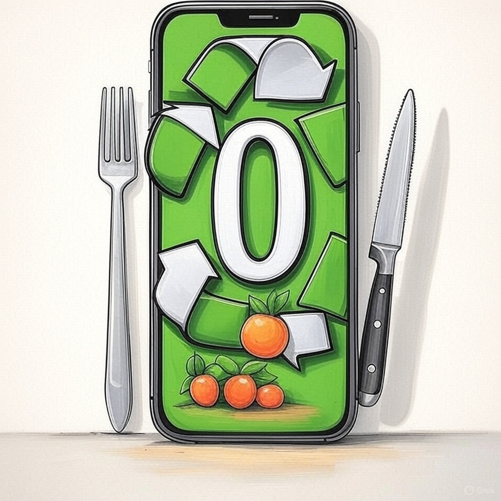

---

Table Of Contents

- [Functional Specifications: Avoid Food Waste Application](#functional-specifications-avoid-food-waste-application)
  - [Introduction](#introduction)
    - [1.1 Glossary](#11-glossary)
    - [1.2 Purpose](#12-purpose)
    - [1.3 Scope](#13-scope)
    - [1.4 Name Explanation](#14-name-explanation)
    - [1.5 Team \& Roles](#15-team--roles)
  - [Requirements](#requirements)
    - [2.1 Core Requirements](#21-core-requirements)
      - [a. Recipe Selection \& Meal Planning](#a-recipe-selection--meal-planning)
      - [b. Pantry Inventory Management](#b-pantry-inventory-management)
      - [c. Intelligent Recipe Suggestions via Chatbot](#c-intelligent-recipe-suggestions-via-chatbot)
      - [d. Recipe Access \& Cooking Guidance](#d-recipe-access--cooking-guidance)
    - [2.2 Deliverables](#22-deliverables)
    - [2.3 Functional Requirements](#23-functional-requirements)
    - [2.4 Non Functional Requirements](#24-non-functional-requirements)
  - [App Mockups](#app-mockups)
    - [3.1 Main App Interface](#31-main-app-interface)
    - [3.2 Recipe Details \& Cooking Steps](#32-recipe-details--cooking-steps)
    - [3.3 Pantry Inventory System](#33-pantry-inventory-system)
    - [3.4 Integrated Chatbot](#34-integrated-chatbot)
    - [3.5 Shopping Cart](#35-shopping-cart)
    - [3.6 Login \& Signup](#36-login--signup)
  - [Context](#context)
    - [4.1 Personas](#41-personas)
      - [Persona 1: Eco-Conscious Emily](#persona-1-eco-conscious-emily)
      - [Persona 2: Budget-Conscious Bob](#persona-2-budget-conscious-bob)
    - [4.2 Use Cases](#42-use-cases)
  - [Risk](#risk)
    - [5.1 Data Security \& Integrity](#51-data-security--integrity)
    - [5.2 Risk Assessment](#52-risk-assessment)
    - [5.3 Market Competitors](#53-market-competitors)
    - [5.4 Risk Management Plan](#54-risk-management-plan)
  - [Future Improvements](#future-improvements)

---

## Introduction

### 1.1 Glossary

Term                          | Definition
-----------------------------|------------------------------------------------------------------------------------------------------------------------------------------------
**Firebase**                     | A Backend-as-a-Service (BaaS) platform by Google offering tools like real-time database (Firestore), authentication, hosting, and file storage. It allows developers to build and scale web and mobile apps without managing infrastructure.
**Chatbot (not-AI)**             | A conversational agent that operates based on rule-based logic (e.g., keyword matching or decision trees), providing responses and actions without machine learning or AI. Useful for structured interactions like recipe suggestions.
**Database**                    | A structured system for storing, managing, and querying data. In this context, recipes, pantry items, user profiles, and preferences are stored in a database (e.g., Firestore).
**Local Storage (Browser)**      | A web storage API that enables websites to store data persistently in a user's browser. Unlike cookies, localStorage is not sent with every HTTP request and is useful for storing app state or user preferences offline.
**Cache**                      | A temporary storage layer that saves static assets (e.g., images, scripts, or data responses) locally to speed up subsequent accesses and reduce server load. Commonly implemented using Service Workers in web apps.
**Navigator Storage (IndexedDB)** | A low-level browser API for storing large amounts of structured data, including files and blobs. It enables offline functionality and complex client-side storage in progressive web apps.
**Authentication**               | A process of verifying the identity of users. Firebase Authentication, for example, allows users to sign in using email/password, Google, or other providers securely.
**Session Storage**              | Similar to localStorage but limited to the duration of a page session. Data is cleared when the page is closed, making it suitable for temporary state like login sessions. |
**API (Application Programming Interface)** | A set of defined rules and protocols that allow different software systems to communicate with each other. In this project, the Spoonacular API is used to retrieve recipe data from a remote server and display it in the app. APIs typically respond with structured data formats like JSON or XML, enabling seamless integration of external content into your application. |

### 1.2 Purpose

The purpose of the **0waste** application is to minimize household food waste by helping users manage their meal planning, pantry inventory, and shopping intelligently. The app empowers individuals to make informed food choices, reduce over-purchasing, and ultimately save money while contributing to environmental sustainability.

### 1.3 Scope

The application is designed for everyday users such as families, students, and eco-conscious consumers. It will offer:

- **Recipe Selection with Customizable Servings:** Users can choose recipes and adjust servings to suit their needs.
- **Automated Shopping List Generation:** The system calculates and compiles the exact quantities of ingredients required.
- **Pantry Inventory Management:** Incorporates current pantry stock into meal planning to avoid unnecessary purchases.
- **Intelligent Chatbot for Recipe Suggestions:** Provides tailored recipe ideas based on available ingredients and user preferences.
- **Additional Enhancements:** Features such as expiration tracking and integration with loyalty programs to further optimize food management.

### 1.4 Name Explanation

The project is named **0watse** because the name offers multiple interpretations. It can be read as "zero waste," aligning with the goal of eliminating food waste, or as a suggestion to "use all you have," emphasizing resource optimization. Moreover, the name is concise and easy to communicate.

### 1.5 Team & Roles

All the roles will be handle by myself.

| **Role**             | **Description**                                                                                                                                           |
|----------------------|-----------------------------------------------------------------------------------------------------------------------------------------------------------|
| **Project Manager**  | Oversees planning, organization, and budgeting. Ensures the team stays on track and motivated.                                                            |
| **Program Manager**  | Defines project goals and ensures alignment with expectations. Leads design efforts and authors the Functional Specifications document.                  |
| **Technical Leader** | Drives technical decisions, translates Functional Specifications into Technical Specifications, reviews code, and provides guidance throughout development. |
| **Technical Writer** | Develops and maintains documentation, including user manuals and technical guides. Collaborates with engineers to ensure clarity and accuracy.             |
| **Software Engineer**| Implements features through coding, participates in technical design discussions, and contributes to maintaining up-to-date documentation.                |
| **Quality Assurance**| Tests features to identify bugs and inconsistencies, documents issues, verifies fixes, and develops/executestest plans.                                     |

---

## Requirements

### 2.1 Core Requirements

#### a. Recipe Selection & Meal Planning

- **User Input:**  
  - Users can browse and select recipes from a curated database.
  - Option to specify the number of servings per recipe.
- **Automated Shopping List:**  
  - The app calculates the exact quantities of ingredients required based on the selected recipe and specified servings.
  - Automatically generates and updates the shopping cart with the required items.

*Example:*  
A user selects a lasagna recipe for four servings; the application computes the precise amounts of each ingredient and adds them to the shopping list.

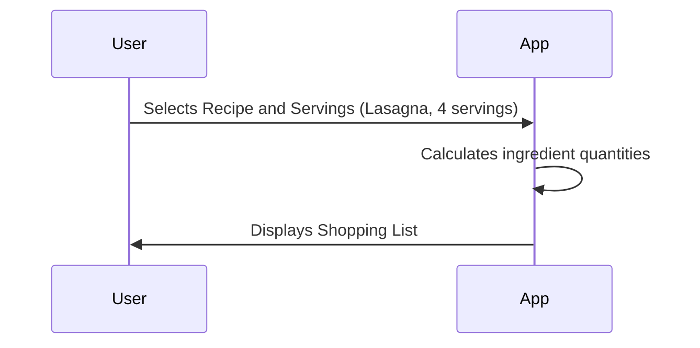

#### b. Pantry Inventory Management

- **Product Addition:**  
  - Users can manually add items they already have in their pantry, including quantity and (optionally) expiration dates. This helps in keeping track of the food they have and prevents over-purchasing.
  
- **Smart Shopping Cart:**  
  - The system cross-references pantry items with the recipe requirements. This ensures that ingredients that are already in stock are not added to the shopping list, saving time and money.
  - Omits ingredients already available, preventing duplicate purchases and optimizing shopping.

*Example:*  
If a recipe requires 200g of pasta and the user has 100g in stock, the shopping list is adjusted to add only the additional 100g required.

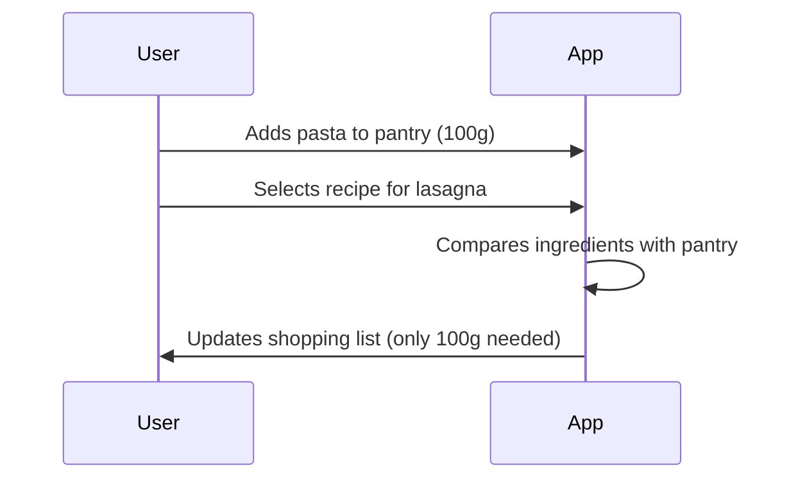

#### c. Intelligent Recipe Suggestions via Chatbot

- **User Interaction:**  
  - A chatbot interacts with users to help them find recipes based on available ingredients or specific preferences. It can understand natural language and suggest recipes accordingly.
  
- **Conversational Guidance:**  
  - The chatbot refines search criteria through dialogue. It can ask follow-up questions like "Do you prefer vegetarian recipes?" or "Do you have any dietary restrictions?" to suggest appropriate recipes.

*Example:*  
A user mentions they have salmon but isn’t sure how to prepare it. The chatbot will propose several salmon-based recipes and allow the user to choose one.

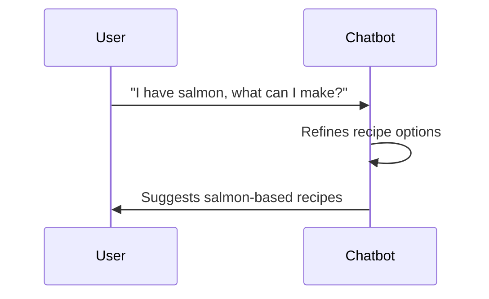

#### d. Recipe Access & Cooking Guidance

- **Digital Cookbook**
  - Provides users with detailed, step-by-step instructions for selected recipes. Users can follow each cooking stage at their own pace, with the ability to go back or forward as needed.

    - To power this feature, the application integrates with the Spoonacular API.

    - Spoonacular is a comprehensive food and recipe database that allows developers to fetch:

    - Recipes with instructions

    - Ingredients and quantities

    - Nutritional information

    - Dietary tags (e.g., vegetarian, gluten-free)

    - Meal planning options

  - By sending HTTP requests to Spoonacular’s endpoints, the app dynamically retrieves the relevant recipe content based on user preferences or chatbot suggestions.
  
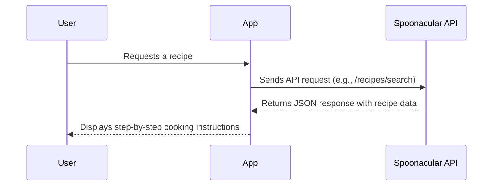

- **Ingredient Tracking:**  
  - Highlights which ingredients are already available in the user's pantry versus those that need to be purchased, ensuring the user knows exactly what to buy.

*Example:*  
After selecting a recipe, the user can view comprehensive cooking instructions and clearly identify which ingredients to buy based on what they already have in their pantry.

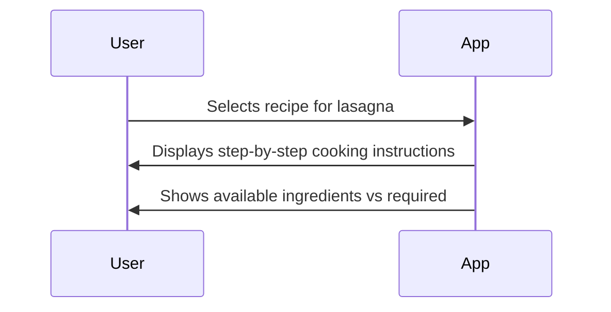

### 2.2 Deliverables

| **Deliverable**             | **Description**                                                      | **Deadline**  |
|-----------------------------|----------------------------------------------------------------------|---------------|
| Functional Specifications   | Detailed document outlining the functional requirements              | --/--/----    |
| Technical Specifications    | Document detailing technical implementation plans                    | --/--/----    |
| Test Plan                   | Comprehensive plan for testing all application features                | --/--/----    |
| Test Cases                  | Specific test cases to validate functionality                          | --/--/----    |
| Code Repository             | Source code for the application                                        | --/--/----    |
| User Manual                 | Documentation for end-users including tutorials and guides             | --/--/----    |

---

### 2.3 Functional Requirements

- **User Interaction Flows:**  
  Detailed workflows for recipe selection, pantry management, and chatbot interactions. This section outlines the paths users will take when using the app, ensuring an intuitive flow.
  
- **Data Processing:**  
  Accurate calculation of ingredient quantities and automated shopping list generation based on user input and existing pantry inventory. The system processes data efficiently to give accurate results quickly.

- **System Integration:**  
  Seamless coordination between the recipe database, inventory management system, and chatbot module to deliver a cohesive user experience. All components should work together smoothly to avoid confusion or disruptions.

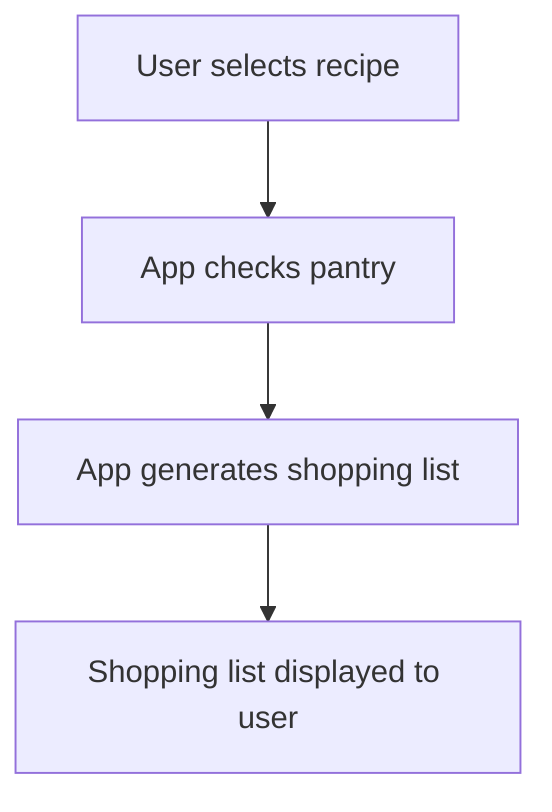

### 2.4 Non Functional Requirements

- **Performance:**  
  The application must generate shopping lists and update inventories in real time with minimal latency. Users should not experience delays when adding items or selecting recipes.

- **Scalability:**  
  The system should efficiently handle an increasing number of recipes and pantry entries without degradation in performance. As the app grows, it should be able to accommodate new features and additional users without issues.

- **Usability:**  
  The user interface must be intuitive and accessible to a wide range of users, ensuring a smooth and engaging experience. This includes support for accessibility features (e.g., text-to-speech, high-contrast mode).

- **Security:**  
  Although minimal sensitive data is handled, secure authentication (with firebase) and robust data integrity measures must be enforced to protect user data.
  - Using a login page to access to your datas.

- **Compatibility:**  
  The application must work on modern web browsers and be responsive to different screen sizes, ensuring accessibility across various devices (e.g., smartphones, tablets, desktops).

- **Reliability:**  
  The system should maintain high availability and consistently process user inputs accurately, even under load. This ensures that users can rely on the application without disruptions.

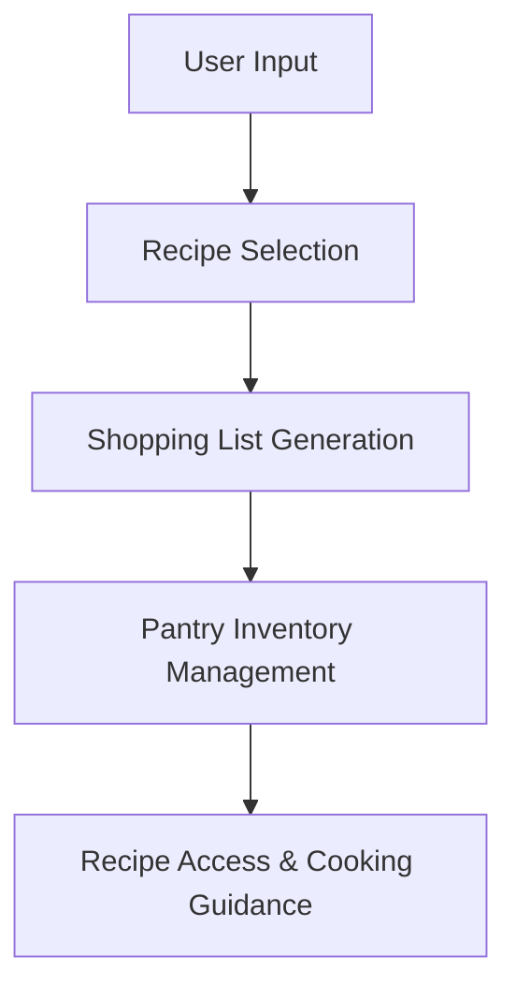

---

## App Mockups

### 3.1 Main App Interface

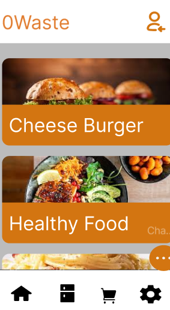
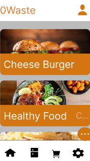

The only difference between these two screens is the icon in the top-right corner, which indicates whether the user is logged in. Clicking on the icon redirects the user to the login or signup pages. Once logged in, the user is redirected back to the main page, and the icon updates accordingly.

### 3.2 Recipe Details & Cooking Steps

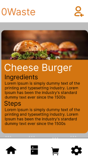

Clicking the button on the main page takes the user to this recipe detail page, which includes the steps for preparing the dish.

### 3.3 Pantry Inventory System

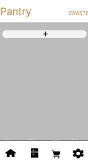
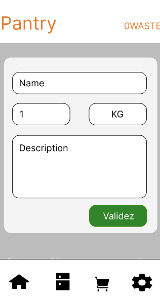

This feature allows users to create and register ingredients. When a recipe is added to the cart, the app checks the pantry to avoid adding ingredients the user already has—helping reduce waste.

### 3.4 Integrated Chatbot

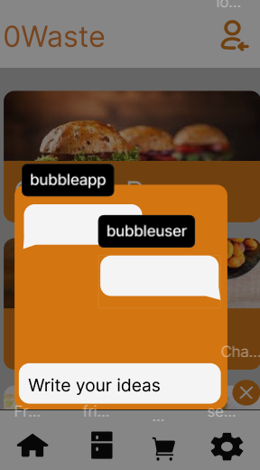
If users have ingredients but don’t know what to cook, they can ask the integrated chatbot. It will suggest recipes based on the available ingredients.

### 3.5 Shopping Cart

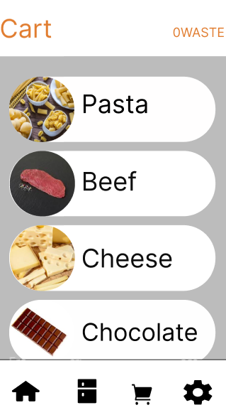

This screen displays the ingredients required for the recipes the user has selected.

### 3.6 Login & Signup

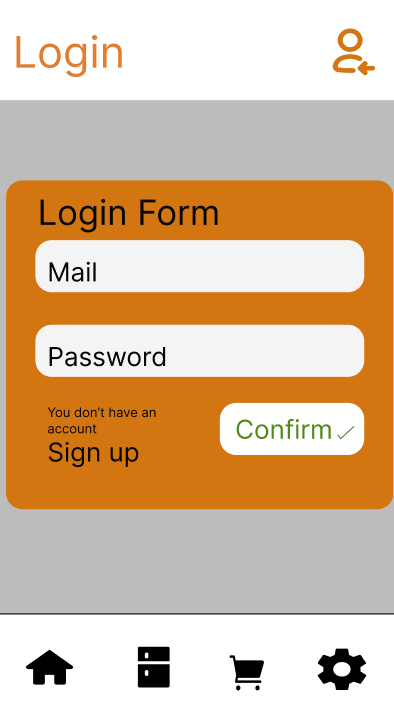
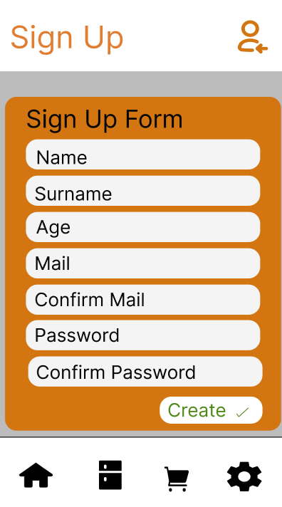

These pages allow users to log in or sign up. Initially, the app can be used without logging in, but in the final version, login will be required. This will be managed using Firebase or a similar service.

## Context

### 4.1 Personas

#### Persona 1: Eco-Conscious Emily

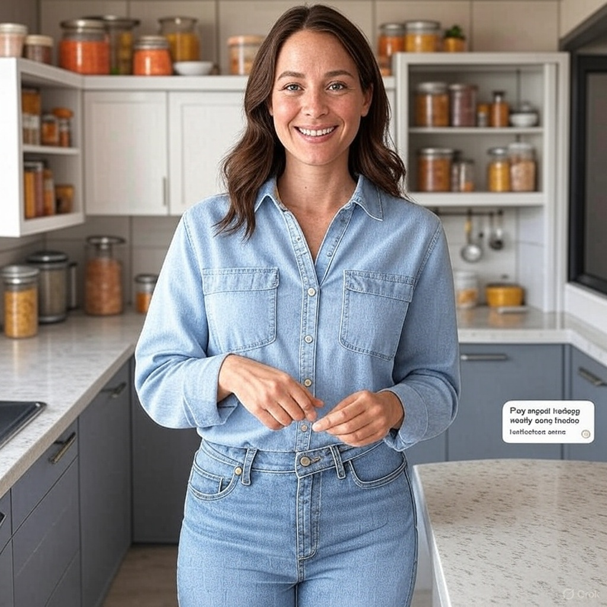

- **Role:** Home Cook & Sustainability Advocate  
- **Age:** 30  
- **Background:** Emily is passionate about reducing her environmental impact and practices sustainable living. She is always looking for ways to minimize waste and optimize her food consumption.  
- **Needs:**  
  - A tool to plan meals based on her existing pantry items.  
  - Notifications for food nearing expiration.  
  - Suggestions for recipes that help reduce waste and promote sustainability.
- **Goals:**  
  - To save money by using what she already has.  
  - To reduce food waste and lower her carbon footprint.

#### Persona 2: Budget-Conscious Bob

- **Role:** Student & Part-Time Worker  
- **Age:** 22  
- **Background:** Bob is on a tight budget and often struggles with food expenses. He wants to avoid overbuying and make the most out of his grocery shopping.  
- **Needs:**  
  - A smart shopping list that adjusts based on his pantry inventory.  
  - Recipe suggestions that are both affordable and efficient.
- **Goals:**  
  - To stick to a budget by preventing unnecessary purchases.  
  - To reduce waste by planning meals with the food he already owns.

### 4.2 Use Cases

| **Use Case**                             | **Description**                                                                                          | **Actor**                     |
|------------------------------------------|----------------------------------------------------------------------------------------------------------|-------------------------------|
| **Meal Planning & Recipe Selection**     | The user selects a recipe and specifies the number of servings; the app generates an accurate shopping list. | Eco-Conscious Emily, Budget-Conscious Bob |
| **Inventory-Based Shopping List**        | The user adds their pantry items, and the system adjusts the shopping list by removing items already available. | Eco-Conscious Emily, Budget-Conscious Bob |
| **Chatbot Recipe Assistance**            | The user interacts with a chatbot to find recipes based on ingredients they have or specific cravings.      | Eco-Conscious Emily           |
| **Expiration Date Notifications**        | The system sends alerts when items in the pantry are nearing their expiration date, suggesting relevant recipes. | Eco-Conscious Emily, Budget-Conscious Bob |
| **Discount & Loyalty Integration**       | The app alerts the user about discounted ingredients at partnered stores and integrates loyalty rewards.    | Budget-Conscious Bob          |
| **Community Food Sharing**               | Users can offer surplus food to nearby app members, fostering community support and reducing waste.        | Eco-Conscious Emily           |

---

## Risk

### 5.1 Data Security & Integrity

- **Authentication:**  
  - Optional sign-in, is implemented to control access, even though the application primarily manages non-sensitive food ingredient data.  
  - Should the scope expand to include sensitive information (e.g., card details), enhanced authentication and security protocols will be introduced.

- **Data Sensitivity:**  
  - The application primarily handles data related to food ingredients, recipes, and inventory, which are not inherently sensitive.
  - In the event that sensitive data is integrated, such as payment information, robust encryption and secure data storage practices will be enforced.

- **Precision & Relevance:**  
  - The system is engineered to prioritize accurate calculations and reliable data management.
  - Comprehensive validation measures and quality checks ensure that the application delivers precise results and effective management support.

- **Security Best Practices:**  
  - Despite its internal use, industry-standard security measures will be adopted to maintain data integrity and support potential future enhancements.

### 5.2 Risk Assessment

| **Risk**                                          | **Likelihood** | **Impact** | **Mitigation Strategy**                                      |
|---------------------------------------------------|----------------|------------|--------------------------------------------------------------|
| Over-purchasing due to inaccurate calculations    | Medium         | High       | Implement robust unit tests and user feedback loops.         |
| Poor integration with external discount systems   | Medium         | Medium     | Regularly update API connections and monitor partner data.   |
| Inaccurate AI recognition in inventory management   | High           | High       | Continuously train the AI model and incorporate manual correction options. |
| User adoption challenges due to complex UI        | Medium         | Medium     | Focus on a minimalist, intuitive design and provide tutorials. |
| Data loss in inventory records                    | Low            | High       | Implement backup solutions and data validation checks.       |

### 5.3 Market Competitors

Several applications currently address food waste reduction, including:

- **Too Good To Go:** Connects users with restaurants and shops selling surplus food at discounted prices.
- **Karma:** Enables retailers to sell surplus food to consumers at reduced prices.
- **Olio:** Facilitates sharing of surplus food among neighbors and local businesses.
- **Jow:** Provides personalized recipe recommendations and transforms them into shopping lists integrated with retail services.

*Note:* Unlike these competitors, the **Avoid Food Waste** application focuses on individual household management, personalized meal planning, and dynamic pantry integration.

### 5.4 Risk Management Plan

- **Risk Identification:**  
  All potential risks, from technical issues (e.g., scalability and AI inaccuracies) to user-centric concerns (e.g., UI complexity and data security), are identified early in the development cycle.

- **Risk Analysis:**  
  Each risk is evaluated based on likelihood and impact, ensuring that high-risk items (like AI recognition errors and scalability issues) receive priority attention.

- **Risk Mitigation:**  
  - **Technical Risks:**  
    Implement comprehensive unit and integration tests, continuously update API integrations, and optimize system architecture to support scalability and reliability.
  - **User-Centric Risks:**  
    Simplify the UI with iterative user testing, provide tutorials, and maintain minimal personal data storage with robust encryption.
  - **Data Security:**  
    Regularly audit data handling practices, comply with data protection laws, and ensure secure data transmission and storage.
  
- **Monitoring & Review:**  
  Establish a schedule for regular risk assessments and adjust mitigation strategies based on real-world usage and feedback. Set up monitoring tools to track system performance and user engagement.

- **Contingency Planning:**  
  Develop contingency protocols for critical failures (e.g., data loss or system downtime) including immediate recovery plans and communication strategies with users.

This risk management plan will be continuously updated throughout the project lifecycle to ensure proactive handling of any issues that arise.

## Future Improvements

1. **Partnerships with Major Supermarkets**
   - Integrate direct ordering through the app (pickup/delivery options).

2. **Advanced AI Enhancements**
   - Personalize recipe and shopping suggestions based on user habits.
   - Incorporate voice command functionality for hands-free operation.
  
3. **Sustainability Metrics**
   - Add carbon footprint analysis for meals and shopping choices.
   - Provide eco-friendly recommendations for ingredient substitutions.
  
4. **Expanded Community Features**
   - Enhance food-sharing capabilities with user ratings and verification.
   - Create forums for recipe exchange and sustainable practices discussion.
  
5. **Enhanced Reporting & Analytics**
   - Develop dashboards to track food waste reduction and cost savings over time.
   - Export shopping and inventory data for further analysis.
