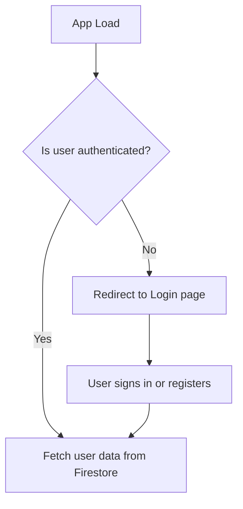
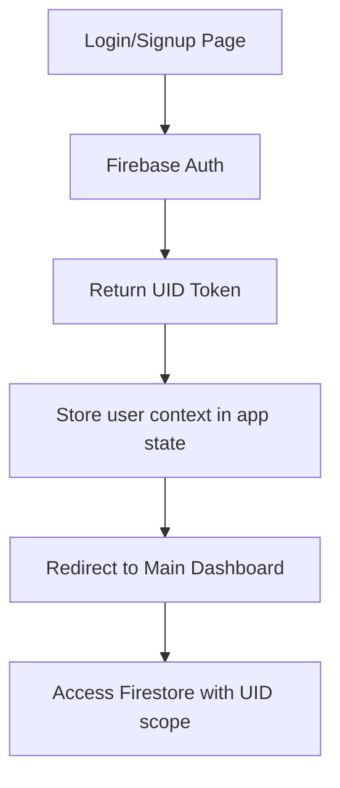
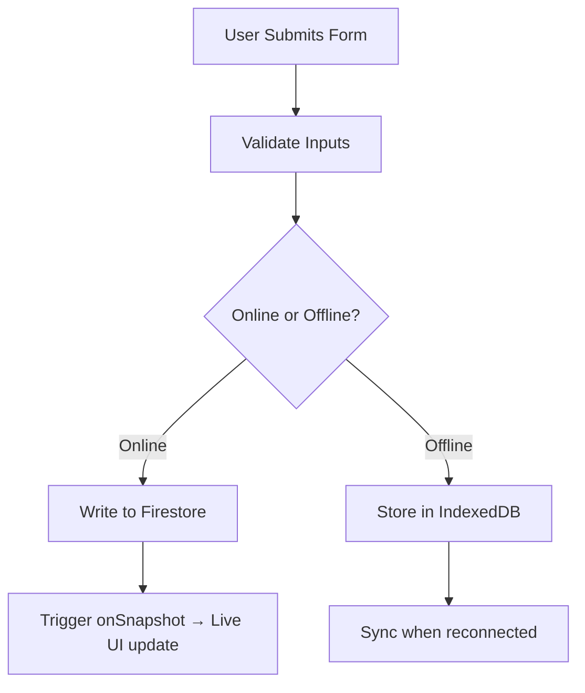

# Technical Specifications – Inventory Web App

- [Technical Specifications – Inventory Web App](#technical-specifications--inventory-web-app)
  - [1. Audience](#1-audience)
    - [🎯 Primary Audiences](#-primary-audiences)
  - [2. Project Overview](#2-project-overview)
    - [🎯 Objectives](#-objectives)
    - [🔑 Core Features](#-core-features)
    - [🛠️ Architecture Philosophy](#️-architecture-philosophy)
    - [🌐 Stack Summary](#-stack-summary)
  - [3. Glossary](#3-glossary)
  - [4. Requirements](#4-requirements)
    - [4.1 Core Features](#41-core-features)
      - [🔐 User Authentication](#-user-authentication)
      - [📦 Inventory Management](#-inventory-management)
      - [🤖 Conversational Assistant](#-conversational-assistant)
      - [📚 Digital Cookbook](#-digital-cookbook)
      - [🧭 Navigation \& UI](#-navigation--ui)
    - [4.2 Performance Goals](#42-performance-goals)
  - [5. System Architecture](#5-system-architecture)
    - [5.1 Technology Stack](#51-technology-stack)
    - [5.2 Firebase Firestore Structure](#52-firebase-firestore-structure)
    - [5.3 Flow Diagrams](#53-flow-diagrams)
      - [Auth Flow](#auth-flow)
      - [Inventory Flow](#inventory-flow)
      - [Recipe Chatbot Flow](#recipe-chatbot-flow)
    - [5.4 Data Persistence](#54-data-persistence)
  - [6. Workflows](#6-workflows)
    - [6.1 Auth Flow](#61-auth-flow)
    - [6.2 Inventory Flow](#62-inventory-flow)
  - [7. Non-Functional Requirements](#7-non-functional-requirements)
  - [8. Deliverables](#8-deliverables)
  - [9. Development Framework](#9-development-framework)
    - [9.1 Code Principles](#91-code-principles)
    - [9.2 Anticipated Challenges](#92-anticipated-challenges)
    - [9.3 Known Bugs (WIP)](#93-known-bugs-wip)
    - [9.4 Dev Process](#94-dev-process)

## 1. Audience

This document is tailored for a **technical audience** that will participate in the development, deployment, and maintenance of the inventory management web application. It outlines architectural decisions, technical flows, and integration strategies to ensure clarity and alignment across the engineering team.

### 🎯 Primary Audiences

- **Frontend Engineers**
  - Responsible for building user interfaces using React and Tailwind CSS.
  - Ensure responsive design, accessibility, and offline support.

- **Backend Engineers**
  - Handle integration with Firebase services and external APIs (e.g., Spoonacular).
  - Ensure Firestore structure aligns with app logic and performance requirements.

- **Technical Architects / Leads**
  - Define system architecture and choose frameworks/tools.
  - Ensure the app is scalable, secure, and maintainable.

- **QA Engineers**
  - Need a clear understanding of workflows, API responses, and edge cases.
  - Will validate data consistency, error handling, and flow completion.

- **Project Managers (Technical)**
  - Require technical visibility for task breakdowns, milestone planning, and sprint cycles.

> ⚠️ This document assumes **working knowledge** of JavaScript/TypeScript, Firebase, REST APIs, and basic cloud architecture principles.

---

## 2. Project Overview

The Inventory Web App is a lightweight, free-to-use platform that promotes sustainable consumption by helping users **track their food inventory**, **discover recipes**, and **minimize food waste**.

The app is built to be **offline-first**, highly responsive, and easy to maintain with no cost to the end-user or the developer.

### 🎯 Objectives

- Provide a seamless way for users to manage their kitchen inventory.
- Suggest recipes dynamically based on what the user already has at home.
- Empower users with a simple and clean UI that works across devices.
- Support offline interaction using browser-based storage like `IndexedDB` or `localStorage`.

---

### 🔑 Core Features

- **Inventory Management**
  - Add, edit, and remove ingredients.
  - Track expiration dates.
  - Persist inventory in Firestore or local storage.

- **Recipe Generation via Chatbot**
  - Suggest recipes based on ingredients using the Spoonacular API.
  - Integrated chat interface powered by a simple Python chatbot or hosted NLP microservice.

- **Digital Cookbook**
  - Display step-by-step instructions fetched from Spoonacular.
  - Filter recipes based on dietary needs (if supported by the free API plan).

- **User Authentication (Optional)**
  - Register/Login with Firebase Authentication.
  - Guest usage enabled during MVP, but user login may be required in production to sync across devices.

- **Offline Capability**
  - Store all data in `IndexedDB` when the user is offline.
  - Sync with Firebase Firestore when the network is available.

---

### 🛠️ Architecture Philosophy

- **Free**: Built with free tiers only (Firebase, Spoonacular API, browser cache).
- **Simple to Deploy**: Runs fully in the browser with no external backend.
- **Mobile-Platform Ready**: Mobile-first, but can be accessible for now on computers.
- **Minimal Latency**: Uses local cache and asynchronous sync to reduce wait time.

---

### 🌐 Stack Summary

| Layer        | Tech                         | Notes                                                  |
|--------------|------------------------------|--------------------------------------------------------|
| Frontend     | React (Vite), Tailwind CSS   | Modern SPA with fast dev experience                   |
| State Mgmt   | Zustand or Context API        | Simple and lightweight state sharing                  |
| Auth         | Firebase Authentication      | Free tier with email/password & anonymous sign-in     |
| Database     | Firebase Firestore           | Real-time sync, rules-based access, free tier support |
| Offline Sync | IndexedDB / localStorage     | Prevents data loss and allows usage with no internet  |
| External API | Spoonacular (Free API key)   | Recipe search, instructions, and ingredient parsing    |

---
## 3. Glossary

| **Term**                  | **Description**                                                                                           |
|---------------------------|-----------------------------------------------------------------------------------------------------------|
| **Firebase Auth**         | A managed service by Google that enables secure user authentication using email/password or anonymous login. |
| **Firestore**             | A scalable, real-time NoSQL cloud database by Firebase. Used to store structured user data per session.   |
| **IndexedDB**             | A low-level, client-side storage API supported in all major browsers. Used to persist data offline.       |
| **LocalStorage**          | A simple key-value storage in the browser for short-term caching and offline capabilities.                |
| **UID**                   | Unique identifier assigned to each authenticated Firebase user.                                           |
| **Spoonacular API**       | A third-party API used to retrieve recipes, ingredients, and instructions for meal preparation.           |
| **React (Vite)**          | A fast, modern web framework using React for UI and Vite for rapid development and bundling.              |
| **Tailwind CSS**          | A utility-first CSS framework optimized for responsive, mobile-first designs.                            |
| **Chatbot**               | A non-AI scripted conversational interface to guide users through recipe suggestions or meal planning.     |
| **Digital Cookbook**      | A feature that fetches and displays cooking recipes and instructions dynamically via API.                 |
| **Cache / Browser Storage**| Methods like IndexedDB or localStorage used to persist user data locally, especially in guest mode.       |
| **CRUD**                  | Stands for Create, Read, Update, and Delete — operations essential for data management.                   |

---

## 4. Requirements

### 4.1 Core Features

#### 🔐 User Authentication

- Enable **sign-up** and **sign-in** using Firebase Authentication (email/password).
- Implement session listeners via `onAuthStateChanged` to maintain login state.
- Store user-specific data using the UID in Firestore (`users/{uid}/items`).
- Provide **persistent login** across app reloads and mobile sessions.
- Include **guest mode** (anonymous usage with IndexedDB) for early app access.
- Redirect unauthenticated users to login/signup before syncing cloud data.

---

#### 📦 Inventory Management

- Full **CRUD operations** on inventory items (Add, View, Edit, Delete).
- Minimum required fields: `name`, `quantity`, `createdAt`, `status`, `tags`.
- Inventory stored in Firebase (`users/{uid}/items`) or locally (IndexedDB) in guest mode.
- Built-in **expiration tracking** for fresh items with reminder notifications.
- Optimize form interactions for mobile: numeric inputs, date pickers, dropdowns.
- Auto-sync when online: push local updates to Firestore when user logs in or reconnects.

---

#### 🤖 Conversational Assistant

- Embedded **chat-style UI** for interacting with a built-in assistant.
- Recipe suggestions based on pantry contents using the **Spoonacular API**.
- Support basic interactions like:
  - “What can I cook with tomatoes and pasta?”
  - “Suggest a dinner under 20 minutes”
- Return links to recipes with images and a “Cook Now” option.
- UI adapts to small screens with a persistent message input and scrollable chat history.

---

#### 📚 Digital Cookbook

- Integrate **Spoonacular API** to fetch recipes and instructions.
- Display recipe cards filtered by ingredients user has.
- Allow users to:
  - View ingredient list
  - Navigate step-by-step cooking instructions
  - Save favorite recipes to their Firebase profile
- Automatically remove ingredients from inventory after cooking (optional prompt).

---

#### 🧭 Navigation & UI

- Fully **mobile-first interface**, responsive on all screen sizes.
- Use **Tailwind CSS** for layout control and mobile touch ergonomics.
- Components:
  - **Navbar** with login state, quick links (Inventory, Chatbot, Cookbook)
  - **Modals or Bottom Sheets** for form inputs and inventory edits
  - **Tabs or Swipes** for intuitive section switching
- Design principle: **clarity > complexity**. Focus on touch-friendly, accessible UI.

---

### 4.2 Performance Goals

| **Goal**              | **Target**                                                                          |
|------------------------|--------------------------------------------------------------------------------------|
| **Firestore Read Time** | ≤ 200ms per request (cold) with caching enabled                                   |
| **IndexedDB Access**   | ≤ 50ms for CRUD operations offline                                                 |
| **Initial App Load**   | ≤ 1 second on 4G networks or equivalent mobile data speeds                         |
| **Mobile UX**          | 60 FPS for animations, scroll, and transitions                                     |
| **Caching Strategy**   | IndexedDB for guest users, fallback storage, and pre-login usage                   |
| **Scalability**        | Firebase Free Tier: supports 50K document reads/day, sufficient for MVP and testing|
| **Offline Support**    | Full functionality in offline mode (except real-time sync and recipe fetch)        |

---

## 5. System Architecture

---

### 5.1 Technology Stack

| **Layer**            | **Tool/Technology**        | **Purpose**                                                                 |
|----------------------|-----------------------------|------------------------------------------------------------------------------|
| **Frontend**         | React + Vite                | UI rendering and app logic. Vite ensures fast build and hot reload in dev. |
| **Styling**          | Tailwind CSS                | Rapid UI development with mobile-first, utility-based design system.       |
| **Authentication**   | Firebase Auth               | Email/password-based user login; session persists across app reloads.      |
| **Database**         | Firebase Firestore          | Real-time NoSQL DB for storing user-specific inventory and recipes.        |
| **Local Caching**    | IndexedDB + localStorage    | Caches data offline; enables guest usage or fallback when offline.         |
| **Hosting** *(opt.)* | Firebase Hosting            | Lightweight static site hosting with HTTPS and global CDN (free tier).     |

> 🔐 **Only auth and inventory data are synced to Firebase.** Everything else (chat context, UI state, recipe browsing history) is handled locally for privacy, performance, and offline access.

---

### 5.2 Firebase Firestore Structure

We follow a **user-isolated data structure**. Each user has a personal `items` subcollection, which ensures data privacy and clean querying.

```plaintext
users/
└── {uid}/
    └── items/
        └── {itemId} : {
             name: string,         // Item name, e.g. "Tomatoes"
             quantity: number,     // Integer or float depending on unit
             createdAt: timestamp, // Firestore auto timestamp
             status: string,       // e.g., "fresh", "expired", "used"
             tags?: string[]       // Optional: e.g. ["vegetable", "organic"]
        }
```

- Document path: `users/{uid}/items/{itemId}`
- All Firestore calls use the authenticated UID from Firebase Auth
- Firebase SDK automatically supports offline reads + queued writes

Best practices:
- Use `createdAt` for sorting/expiration features
- Filter and categorize via `tags`
- Store units or measurement type via additional fields if needed later

---

### 5.3 Flow Diagrams

#### Auth Flow



- `onAuthStateChanged` checks Firebase Auth session on load
- If authenticated, fetch inventory from Firestore
- If not, redirect user to login or load guest mode with local data

---

#### Inventory Flow

```mermaid
flowchart TD
    A[App Start] --> B{Online or Offline?}
    B -- Online --> C{Is user authenticated?}
    C -- Yes --> D[Sync IndexedDB to Firestore]
    C -- No --> E[Use IndexedDB only (guest mode)]
    B -- Offline --> F[Load Inventory from IndexedDB]
```

- Ensures full CRUD even in guest or offline state
- Changes queued and synced to Firestore when reconnected
- IndexedDB stores the exact same structure for compatibility

---

#### Recipe Chatbot Flow

```mermaid
flowchart TD
    A[Inventory Page] --> B[User clicks "Suggest Recipe"]
    B --> C[Collect available ingredients]
    C --> D[Send ingredients to Spoonacular API]
    D --> E[Receive recipe suggestions]
    E --> F[Display cards with "Cook Now" option]
    F --> G[Show interactive, step-by-step instructions]
```

- Local pantry is the source of truth
- API queries only include ingredients the user has
- Assistant uses formatted prompt logic (non-AI) to query Spoonacular

---

### 5.4 Data Persistence

**Authentication Persistence**

- Firebase Auth stores session in browser localStorage by default
- Automatically restores state on app reload via Firebase SDK
- Users remain logged in until they manually log out

**Inventory Data**

- Authenticated Users:
  - Firestore stores all data in `users/{uid}/items`
  - Auto-synced in real-time, with offline buffering
- Guest Mode / Offline Users:
  - IndexedDB used for structured offline CRUD
  - Synced to Firestore once the user logs in or reconnects
  - Uses `idb` or custom wrapper hook for data access

**Caching Strategy**

- Recipes from API may optionally be cached in localStorage (read-only)
- UI state (e.g. scroll position, tabs) is stored transiently in-memory or sessionStorage

> 💡 This hybrid strategy ensures maximum usability, even with zero connectivity, while keeping Firebase usage within free tier limits.

---

## 6. Workflows

---

### 6.1 Auth Flow

The authentication process ensures that user data remains isolated and persistent across sessions. Firebase Authentication handles secure login and state persistence, while React manages app state for routing and access control.



**Detailed Steps:**

1. User enters credentials on login or signup form
2. Firebase Auth returns a `UID` and sets session token
3. App initializes a global auth context (`AuthProvider`)
4. Firestore reads/writes are scoped under `users/{uid}/`
5. On logout, context is cleared and user redirected

---

### 6.2 Inventory Flow

Inventory management supports both real-time Firestore sync and offline IndexedDB fallback. Data integrity and UX responsiveness are prioritized.



**Detailed Steps:**

1. User fills form for `add`, `edit`, or `delete`
2. App validates required fields: `name`, `quantity`, etc.
3. If online:
   - Firestore write under `users/{uid}/items`
   - Firestore’s `onSnapshot` updates dashboard instantly
4. If offline:
   - Write cached in IndexedDB
   - Sync to Firestore on next reconnection (if user is logged in)

> ⚙️ Real-time UI updates and form feedback ensure a smooth experience regardless of connectivity.

---

## 7. Non-Functional Requirements

These define the system’s behavior beyond specific features—focusing on performance, reliability, and maintainability to ensure long-term usability.

| **Category**     | **Requirement**                                                                 |
|------------------|----------------------------------------------------------------------------------|
| **Performance**  | Fast interactions (<100ms), optimized re-renders, IndexedDB for local ops       |
| **Reliability**  | Firestore's real-time sync + offline queueing ensures consistent experience     |
| **Usability**    | Clean, mobile-first layout with accessible forms and responsive feedback        |
| **Security**     | Firestore rules enforce per-user access; auth routes protected at router level  |
| **Maintainability** | Modular component structure, type-safe props, and scoped hooks               |
| **Data Integrity** | Form-level and schema validation prior to submission to prevent bad writes    |
| **Compliance**   | Firebase services are GDPR-compliant by default; only minimal personal data used |

> 🔐 **Security & compliance are built-in**: Firebase handles encryption, auth, and compliance (e.g. GDPR), reducing burden on the dev team.

---

## 8. Deliverables

---

The following outputs are expected as part of the development and delivery process of the Inventory Web App:

- **✅ Source Code (Git Repository)**  
  - All source files organized under a clear folder structure  
  - Includes components, hooks, context, and utility functions  
  - Environment configuration (`.env.example`) provided  
  - Git-based version control with meaningful commit messages

- **✅ Working Firebase Project**  
  - Functional Firebase setup with:
    - Firebase Authentication enabled
    - Firestore database provisioned and structured
    - Firebase rules in place for scoped data access

- **✅ Example Firestore Security Rules**  
  - A file or section with tested security rules limiting access by UID  
  - Written with least privilege and user-level scope in mind  
  - Includes rules for reads, writes, and validations

- **✅ Deployment Script or Guide**  
  - A CLI script or `README.md` with instructions to:
    - Install dependencies (`npm install`)
    - Set up Firebase CLI and project (`firebase init`)
    - Run locally (`npm run dev`)
    - Deploy to Firebase Hosting (`firebase deploy`)

- **📸 Screenshots / Video Demo (Optional)**  
  - (Optional but recommended) A walkthrough video or image sequence demonstrating:
    - Auth flow
    - Inventory operations
    - Chatbot and cookbook usage

> 📦 Deliverables should be self-contained to allow another dev to clone, setup, and deploy without ambiguity.

---

## 9. Development Framework

---

### 9.1 Code Principles

The project will follow clear, modular, and maintainable coding principles:

- **Component Reusability (React)**  
  - Build UI elements as atomic components (e.g., `Button`, `Card`, `ItemRow`)  
  - Use composition to extend functionality rather than duplicate logic

- **State Management via Context or Zustand**  
  - Global auth state via `React Context`  
  - Local or per-feature state with lightweight tools like `Zustand` or `useReducer`  
  - Avoid prop drilling and maintain predictable state updates

- **Separation of Concerns**  
  - Logic extracted into custom hooks (`useInventory`, `useAuth`)  
  - API and storage logic separated into service modules  
  - UI, state, and side-effects clearly decoupled

- **Type Safety (Optional TypeScript)**  
  - Types/interfaces for inventory items, recipe structures, and auth users  
  - Reduce runtime bugs and improve DX (Developer Experience)

- **Naming & Structure**  
  - File-based routing and modular folders (`/components`, `/hooks`, `/services`, `/pages`)  
  - Clear and consistent naming conventions (camelCase, kebab-case for files)

---

### 9.2 Anticipated Challenges

| Challenge                          | Description                                                                 |
|-----------------------------------|-----------------------------------------------------------------------------|
| **Offline Edge Cases**            | Handling item updates when offline and syncing to Firestore without loss   |
| **Merge Conflicts on Sync**       | Managing item duplication or overwrites during reconnection                |
| **Security Rule Misconfigurations** | Risk of overexposing user data or blocking legitimate actions              |
| **Browser Storage Limits**        | IndexedDB has storage limits that vary by browser (~50MB typically)        |
| **API Rate Limits (Spoonacular)** | Free tier limits could restrict usage under heavy testing or load          |

> 🔄 Offline-first logic adds significant complexity—proper testing and fallback flows are essential.

---

### 9.3 Known Bugs (WIP)

Bugs will be tracked and resolved iteratively using GitHub Issues or a similar ticketing system.

Initial known concerns include:

- 🔁 Double writes on re-connection in offline mode
- ⚠️ UI race conditions during simultaneous edits
- 📆 Incorrect expiration sorting on some browsers
- 🔒 Misaligned Firestore rules when new fields are added

> Bugs will be labeled, prioritized, and addressed via pull requests.

---

### 9.4 Dev Process

The development strategy follows an agile, iteration-first approach:

- **Feature-Driven Development**  
  - New features built in isolated branches  
  - Small, testable chunks pushed regularly

- **Code Reviews & Testing**  
  - Peer-reviewed PRs (if in team setting)  
  - Manual testing for UX and data correctness

- **Deployment Strategy**  
  - Firebase CLI for deployment to live/staging environments  
  - CI/CD optional but scriptable with GitHub Actions

- **Documentation**  
  - All major components and hooks documented inline  
  - `README.md` provides setup, usage, and contribution guidelines

> 🔁 Iterative delivery enables early feedback and fast adaptation to changes.

---
