<div align="center">

# Technical Specifications – Inventory Web App

**Author:** Alexandre Bopp

**Title:** Technical Specification

**Last updated:** May 03, 2025

**Team:** 5

</div>

- [Technical Specifications – Inventory Web App](#technical-specifications--inventory-web-app)
  - [1. Audience](#1-audience)
    - [🎯 Primary Audiences](#-primary-audiences)
  - [2. Project Overview – Explained](#2-project-overview--explained)
    - [✨ Objectives (What, Why, How)](#-objectives-what-why-how)
    - [🔑 Core Features – With Purpose](#-core-features--with-purpose)
      - [1. Inventory Management](#1-inventory-management)
      - [2. Recipe Generation via Chatbot](#2-recipe-generation-via-chatbot)
      - [3. Digital Cookbook](#3-digital-cookbook)
      - [4. User Authentication (Optional)](#4-user-authentication-optional)
      - [5. Offline Capability](#5-offline-capability)
    - [📈 Architecture Philosophy](#-architecture-philosophy)
    - [🌐 Stack Summary – Explained](#-stack-summary--explained)
  - [3. Glossary](#3-glossary)
  - [4. Requirements](#4-requirements)
    - [4.1 Core Features](#41-core-features)
      - [🔐 User Authentication](#-user-authentication)
      - [📦 Inventory Management](#-inventory-management)
      - [🤖 Conversational Assistant](#-conversational-assistant)
      - [📚 Digital Cookbook](#-digital-cookbook)
      - [🧭 Navigation \& UI](#-navigation--ui)
    - [4.2 Performance Goals](#42-performance-goals)
  - [5. System Architecture](#5-system-architecture)
    - [5.1 Technology Stack](#51-technology-stack)
    - [5.2 Firebase Firestore Structure](#52-firebase-firestore-structure)
    - [5.3 Flow Diagrams](#53-flow-diagrams)
      - [Auth Flow](#auth-flow)
      - [Inventory Flow](#inventory-flow)
      - [Recipe Chatbot Flow](#recipe-chatbot-flow)
    - [5.4 Data Persistence](#54-data-persistence)
  - [6. Workflows](#6-workflows)
    - [6.1 Auth Flow](#61-auth-flow)
    - [6.2 Inventory Flow](#62-inventory-flow)
  - [7. Non-Functional Requirements](#7-non-functional-requirements)
  - [8. Deliverables](#8-deliverables)
    - [✅ Source Code (Git Repository)](#-source-code-git-repository)
    - [✅ Firebase Project (Functional Setup)](#-firebase-project-functional-setup)
    - [✅ Firestore Security Rules (Example File)](#-firestore-security-rules-example-file)
    - [✅ README File With Setup Instructions](#-readme-file-with-setup-instructions)
    - [📸 Screenshots / User Manual](#-screenshots--user-manual)
  - [9. Development Framework](#9-development-framework)
    - [9.1 Code Principles](#91-code-principles)
    - [9.2 Anticipated Challenges](#92-anticipated-challenges)
    - [9.3 Known Bugs (WIP)](#93-known-bugs-wip)
    - [9.4 Dev Process](#94-dev-process)
      - [Feature-First Iterative Development](#feature-first-iterative-development)
      - [Version Control](#version-control)
      - [Deployment Workflow](#deployment-workflow)
      - [Documentation](#documentation)
    - [9.5 Testing Strategy](#95-testing-strategy)
      - [Unit Testing](#unit-testing)
      - [Component Testing](#component-testing)
      - [Integration Testing](#integration-testing)
      - [Manual \& Exploratory Testing](#manual--exploratory-testing)
      - [Firebase Rules Testing](#firebase-rules-testing)

## 1. Audience

This document is tailored for a **technical audience** that will participate in the development, deployment, and maintenance of the inventory management web application. It outlines architectural decisions, technical flows, and integration strategies to ensure clarity and alignment across the engineering team.

### 🎯 Primary Audiences

- **Frontend Engineers**
  - Responsible for building user interfaces using React and Tailwind CSS.
  - Ensure responsive design, accessibility, and offline support.

- **Backend Engineers**
  - Handle integration with Firebase services and external APIs (e.g., Spoonacular).
  - Ensure Firestore structure aligns with app logic and performance requirements.

- **Technical Architects / Leads**
  - Define system architecture and choose frameworks/tools.
  - Ensure the app is scalable, secure, and maintainable.

- **QA Engineers**
  - Need a clear understanding of workflows, API responses, and edge cases.
  - Will validate data consistency, error handling, and flow completion.

- **Project Managers (Technical)**
  - Require technical visibility for task breakdowns, milestone planning, and sprint cycles.

> ⚠️ This document assumes **working knowledge** of JavaScript/TypeScript, Firebase, REST APIs, and basic cloud architecture principles.

---

## 2. Project Overview – Explained

The **Inventory Web App** is designed as a lightweight, free-to-use solution to promote **sustainable food consumption**. It allows users to track what they have at home, discover recipes using those ingredients, and reduce waste — all while supporting offline access.

The following explains **what the app does**, **why each feature exists**, and **how it is implemented**.

---

### ✨ Objectives (What, Why, How)

* **What:** Enable users to manage kitchen inventory seamlessly.

  * **Why:** Manual tracking leads to forgotten or wasted items. A digital system improves awareness and organization.
  * **How:** Users can add, edit, or delete items in a simple UI backed by Firestore or local storage.

* **What:** Dynamically suggest recipes based on available ingredients.

  * **Why:** Encourages users to cook with what they already have, reducing unnecessary purchases.
  * **How:** A chatbot interface uses the Spoonacular API to generate recipe suggestions based on pantry contents.

* **What:** Provide a responsive, mobile-first UI.

  * **Why:** The primary user device is likely a smartphone in the kitchen. UX must be optimized for small screens.
  * **How:** The app uses Tailwind CSS and React for fast, responsive layouts.

* **What:** Support full offline functionality.

  * **Why:** Users may not always have stable internet access (e.g., while shopping or cooking).
  * **How:** Uses `IndexedDB` to cache data locally, syncing to Firestore when online.

---

### 🔑 Core Features – With Purpose

#### 1. Inventory Management

* Core to the app’s mission — tracks what users own.
* Users perform CRUD (Create, Read, Update, Delete) actions on their items, stored either in Firestore (if authenticated) or IndexedDB (if offline or in guest mode).
* **Extra:** Expiration tracking helps users prioritize usage before spoilage.

#### 2. Recipe Generation via Chatbot

* Solves the classic “What can I cook tonight?” problem using existing pantry items.
* Integrates with the Spoonacular API. Users input ingredients or meal types into a chatbot interface to receive recipe suggestions.
* **Extra:** The assistant provides links and images, improving engagement.

#### 3. Digital Cookbook

* Helps users follow instructions without switching platforms.
* Displays recipe cards with ingredient lists and step-by-step guides fetched via API.
* **Optional Feature:** After cooking, prompt to auto-remove used ingredients from inventory.

#### 4. User Authentication (Optional)

* Allows data sync across devices and stores user preferences.
* Firebase Authentication supports login with email/password or anonymous sign-in. Guest users rely on local caching (IndexedDB).
* **Security:** All Firestore records are tied to a UID to isolate data.

#### 5. Offline Capability

* Essential for usability in real-world kitchen or grocery scenarios.
* IndexedDB handles all CRUD operations offline. When the network returns, changes are synced to Firestore using a background service.

---

### 📈 Architecture Philosophy

| Principle           | Why It Matters                                   | How It’s Achieved                                 |
| ------------------- | ------------------------------------------------ | ------------------------------------------------- |
| **Free to Run**     | Keeps the app sustainable and open to more users | Uses Firebase's free tier, Spoonacular's free API |
| **Deploy Anywhere** | Makes setup and hosting effortless               | Built with Vite + Firebase Hosting                |
| **Mobile-First**    | Most users will access via phone                 | Tailwind CSS, responsive layouts                  |
| **Fast & Offline**  | Reduces friction in low-connectivity areas       | IndexedDB caching, async sync to Firestore        |

---

### 🌐 Stack Summary – Explained

| Layer          | Tech                       | Why This Tool / How It’s Used                                          |
| -------------- | -------------------------- | ---------------------------------------------------------------------- |
| **Frontend**   | React (Vite), Tailwind CSS | Fast SPA with responsive UI and atomic components                      |
| **State Mgmt** | Zustand or Context API     | Zustand for scalable feature state (e.g., inventory), Context for auth |
| **Auth**       | Firebase Authentication    | Easy to implement, secure, session persistence out-of-the-box          |
| **Database**   | Firebase Firestore         | Scalable NoSQL with real-time sync and offline queueing                |
| **Offline**    | IndexedDB / localStorage   | Full offline support, guest usage, persistent caching                  |
| **API**        | Spoonacular (Free Tier)    | Rich recipe data and NLP-powered search functionality                  |


---

## 3. Glossary

| **Term**                  | **Description**                                                                                           |
|---------------------------|-----------------------------------------------------------------------------------------------------------|
| **Firebase Auth**         | A managed service by Google that enables secure user authentication using email/password or anonymous login. |
| **Firestore**             | A scalable, real-time NoSQL cloud database by Firebase. Used to store structured user data per session.   |
| **IndexedDB**             | A low-level, client-side storage API supported in all major browsers. Used to persist data offline.       |
| **LocalStorage**          | A simple key-value storage in the browser for short-term caching and offline capabilities.                |
| **UID**                   | Unique identifier assigned to each authenticated Firebase user.                                           |
| **Spoonacular API**       | A third-party API used to retrieve recipes, ingredients, and instructions for meal preparation.           |
| **React (Vite)**          | A fast, modern web framework using React for UI and Vite for rapid development and bundling.              |
| **Tailwind CSS**          | A utility-first CSS framework optimized for responsive, mobile-first designs.                            |
| **Chatbot**               | A non-AI scripted conversational interface to guide users through recipe suggestions or meal planning.     |
| **Digital Cookbook**      | A feature that fetches and displays cooking recipes and instructions dynamically via API.                 |
| **Cache / Browser Storage**| Methods like IndexedDB or localStorage used to persist user data locally, especially in guest mode.       |
| **CRUD**                  | Stands for Create, Read, Update, and Delete — operations essential for data management.                   |

---

## 4. Requirements

### 4.1 Core Features

#### 🔐 User Authentication

- Enable **sign-up** and **sign-in** using Firebase Authentication (email/password).
- Implement session listeners via `onAuthStateChanged` to maintain login state.
- Store user-specific data using the UID in Firestore (`users/{uid}/items`).
- Provide **persistent login** across app reloads and mobile sessions.
- Include **guest mode** (anonymous usage with IndexedDB) for early app access.
- Redirect unauthenticated users to login/signup before syncing cloud data.

---

#### 📦 Inventory Management

- Full **CRUD operations** on inventory items (Add, View, Edit, Delete).
- Minimum required fields: `name`, `quantity`, `createdAt`, `status`, `tags`.
- Inventory stored in Firebase (`users/{uid}/items`) or locally (IndexedDB) in guest mode.
- Built-in **expiration tracking** for fresh items with reminder notifications.
- Optimize form interactions for mobile: numeric inputs, date pickers, dropdowns.
- Auto-sync when online: push local updates to Firestore when user logs in or reconnects.

---

#### 🤖 Conversational Assistant

- Embedded **chat-style UI** for interacting with a built-in assistant.
- Recipe suggestions based on pantry contents using the **Spoonacular API**.
- Support basic interactions like:
  - “What can I cook with tomatoes and pasta?”
  - “Suggest a dinner under 20 minutes”
- Return links to recipes with images and a “Cook Now” option.
- UI adapts to small screens with a persistent message input and scrollable chat history.

---

#### 📚 Digital Cookbook

- Integrate **Spoonacular API** to fetch recipes and instructions.
- Display recipe cards filtered by ingredients user has.
- Allow users to:
  - View ingredient list
  - Navigate step-by-step cooking instructions
  - Save favorite recipes to their Firebase profile
- Automatically remove ingredients from inventory after cooking (optional prompt).

---

#### 🧭 Navigation & UI

- Fully **mobile-first interface**, responsive on all screen sizes.
- Use **Tailwind CSS** for layout control and mobile touch ergonomics.
- Components:
  - **Navbar** with login state, quick links (Inventory, Chatbot, Cookbook)
  - **Modals or Bottom Sheets** for form inputs and inventory edits
  - **Tabs or Swipes** for intuitive section switching
- Design principle: **clarity > complexity**. Focus on touch-friendly, accessible UI.

---

### 4.2 Performance Goals

| **Goal**              | **Target**                                                                          |
|------------------------|--------------------------------------------------------------------------------------|
| **Firestore Read Time** | ≤ 200ms per request (cold) with caching enabled                                   |
| **IndexedDB Access**   | ≤ 50ms for CRUD operations offline                                                 |
| **Initial App Load**   | ≤ 1 second on 4G networks or equivalent mobile data speeds                         |
| **Mobile UX**          | 60 FPS for animations, scroll, and transitions                                     |
| **Caching Strategy**   | IndexedDB for guest users, fallback storage, and pre-login usage                   |
| **Scalability**        | Firebase Free Tier: supports 50K document reads/day, sufficient for MVP and testing|
| **Offline Support**    | Full functionality in offline mode (except real-time sync and recipe fetch)        |

---

## 5. System Architecture

---

### 5.1 Technology Stack

| **Layer**            | **Tool/Technology**        | **Purpose**                                                                 |
|----------------------|-----------------------------|------------------------------------------------------------------------------|
| **Frontend**         | React + Vite                | UI rendering and app logic. Vite ensures fast build and hot reload in dev. |
| **Styling**          | Tailwind CSS                | Rapid UI development with mobile-first, utility-based design system.       |
| **Authentication**   | Firebase Auth               | Email/password-based user login; session persists across app reloads.      |
| **Database**         | Firebase Firestore          | Real-time NoSQL DB for storing user-specific inventory and recipes.        |
| **Local Caching**    | IndexedDB + localStorage    | Caches data offline; enables guest usage or fallback when offline.         |
| **Hosting** *(opt.)* | Firebase Hosting            | Lightweight static site hosting with HTTPS and global CDN (free tier).     |

> 🔐 **Only auth and inventory data are synced to Firebase.** Everything else (chat context, UI state, recipe browsing history) is handled locally for privacy, performance, and offline access.

---

### 5.2 Firebase Firestore Structure

We follow a **user-isolated data structure**. Each user has a personal `items` subcollection, which ensures data privacy and clean querying.

```plaintext
users/
└── {uid}/
    └── items/
        └── {itemId} : {
             name: string,         // Item name, e.g. "Tomatoes"
             quantity: number,     // Integer or float depending on unit
             createdAt: timestamp, // Firestore auto timestamp
             status: string,       // e.g., "fresh", "expired", "used"
             tags?: string[]       // Optional: e.g. ["vegetable", "organic"]
        }
```

- Document path: `users/{uid}/items/{itemId}`
- All Firestore calls use the authenticated UID from Firebase Auth
- Firebase SDK automatically supports offline reads + queued writes

Best practices:
- Use `createdAt` for sorting/expiration features
- Filter and categorize via `tags`
- Store units or measurement type via additional fields if needed later

---

### 5.3 Flow Diagrams

#### Auth Flow


- `onAuthStateChanged` checks Firebase Auth session on load
- If authenticated, fetch inventory from Firestore
- If not, redirect user to login or load guest mode with local data

**Pseudocode:**
```js
onAuthStateChanged(auth, (user) => {
  if (user) {
    // Authenticated session
    fetchUserInventory(user.uid); // Load inventory from Firestore
  } else {
    // Unauthenticated session
    navigateTo('/login'); // Or allow guest mode with local storage
  }
});
```

---

#### Inventory Flow


- Ensures full CRUD even in guest or offline state
- Changes queued and synced to Firestore when reconnected
- IndexedDB stores the exact same structure for compatibility

**Pseudocode:**
```js
  if (navigator.onLine) {
    if (userIsAuthenticated()) {
      const localData = readFromIndexedDB();
      syncToFirestore(localData); // Push changes online
    } else {
      const guestData = readFromIndexedDB();
      useLocalState(guestData); // Guest mode, no sync
    }
  } else {
    const offlineData = readFromIndexedDB();
    useLocalState(offlineData); // Fully offline fallback
  }
```


---

#### Recipe Chatbot Flow


- Local pantry is the source of truth
- API queries only include ingredients the user has
- Assistant uses formatted prompt logic (non-AI) to query Spoonacular

**Pseudocode:**
```js
  function handleSuggestRecipe() {
    const ingredients = getAvailableIngredients(); // From inventory state

    fetch(`https://api.spoonacular.com/recipes/findByIngredients?ingredients=${ingredients.join(',')}`)
      .then(response => response.json())
      .then(recipes => {
        displayRecipeCards(recipes); // Show as clickable cards
      });
  }

  function handleCookNow(recipeId) {
    fetch(`https://api.spoonacular.com/recipes/${recipeId}/analyzedInstructions`)
      .then(response => response.json())
      .then(steps => {
        showStepByStepInstructions(steps); // One step at a time
      });
  }
```

---

### 5.4 Data Persistence

**Authentication Persistence**

- Firebase Auth stores session in browser localStorage by default
- Automatically restores state on app reload via Firebase SDK
- Users remain logged in until they manually log out

**Inventory Data**

- Authenticated Users:
  - Firestore stores all data in `users/{uid}/items`
  - Auto-synced in real-time, with offline buffering
- Guest Mode / Offline Users:
  - IndexedDB used for structured offline CRUD
  - Synced to Firestore once the user logs in or reconnects
  - Uses `idb` or custom wrapper hook for data access

**Caching Strategy**

- Recipes from API may optionally be cached in localStorage (read-only)
- UI state (e.g. scroll position, tabs) is stored transiently in-memory or sessionStorage

> 💡 This hybrid strategy ensures maximum usability, even with zero connectivity, while keeping Firebase usage within free tier limits.

---

## 6. Workflows

---

### 6.1 Auth Flow

The authentication process ensures that user data remains isolated and persistent across sessions. Firebase Authentication handles secure login and state persistence, while React manages app state for routing and access control.


**Detailed Steps:**

1. User enters credentials on login or signup form
2. Firebase Auth returns a `UID` and sets session token
3. App initializes a global auth context (`AuthProvider`)
4. Firestore reads/writes are scoped under `users/{uid}/`
5. On logout, context is cleared and user redirected

---

### 6.2 Inventory Flow

Inventory management supports both real-time Firestore sync and offline IndexedDB fallback. Data integrity and UX responsiveness are prioritized.

```mermaid
flowchart TD
    A[User Submits Form] --> B[Validate Inputs]
    B --> C{Online or Offline?}
    C -- Online --> D[Write to Firestore]
    D --> E[Trigger onSnapshot → Live UI update]
    C -- Offline --> F[Store in IndexedDB]
    F --> G[Sync when reconnected]
```



**Detailed Steps:**

1. User fills form for `add`, `edit`, or `delete`
2. App validates required fields: `name`, `quantity`, etc.
3. If online:
   - Firestore write under `users/{uid}/items`
   - Firestore’s `onSnapshot` updates dashboard instantly
4. If offline:
   - Write cached in IndexedDB
   - Sync to Firestore on next reconnection (if user is logged in)

> ⚙️ Real-time UI updates and form feedback ensure a smooth experience regardless of connectivity.

---

## 7. Non-Functional Requirements

These define the system’s behavior beyond specific features—focusing on performance, reliability, and maintainability to ensure long-term usability.

| **Category**     | **Requirement**                                                                 |
|------------------|----------------------------------------------------------------------------------|
| **Performance**  | Fast interactions (<100ms), optimized re-renders, IndexedDB for local ops       |
| **Reliability**  | Firestore's real-time sync + offline queueing ensures consistent experience     |
| **Usability**    | Clean, mobile-first layout with accessible forms and responsive feedback        |
| **Security**     | Firestore rules enforce per-user access; auth routes protected at router level  |
| **Maintainability** | Modular component structure, type-safe props, and scoped hooks               |
| **Data Integrity** | Form-level and schema validation prior to submission to prevent bad writes    |
| **Compliance**   | Firebase services are GDPR-compliant by default; only minimal personal data used |

> 🔐 **Security & compliance are built-in**: Firebase handles encryption, auth, and compliance (e.g. GDPR), reducing burden on the dev team.

---

## 8. Deliverables

---

The following deliverables are expected to ensure the Inventory Web App is easy to run, maintain, and extend by any developer joining the project.

### ✅ Source Code (Git Repository)

- Well-structured source code following industry conventions
- Includes all components, hooks, contexts, and utilities
- `.env.example` file provided to guide environment variable setup
- Clean Git history with descriptive commit messages
- Modular folder organization for frontend logic and configuration

> The goal is to provide a clean starting point and full visibility into how the app works under the hood.

---

### ✅ Firebase Project (Functional Setup)

- Firebase Authentication enabled with email/password and anonymous sign-in
- Firestore rules configured for user-scoped access control
- Firebase initialized and ready for local and production usage

> Firebase setup ensures the app can be deployed without additional backend work and remains scalable using free-tier infrastructure.

---

### ✅ Firestore Security Rules (Example File)

- Clear and scoped rules based on authenticated user UID
- Prevents unauthorized reads/writes across users
- Includes validation logic for common fields (e.g., `createdAt`, `status`)

> Security is a first-class concern — rules are designed with the principle of least privilege and future extensibility in mind.

---

### ✅ README File With Setup Instructions

- Step-by-step guide to:
  - Clone the project
  - Install dependencies (`npm install`)
  - Configure Firebase and environment variables
  - Run the app locally (`npm run dev`)
  - Deploy to Firebase Hosting (`firebase deploy`)
- Includes links to tools (Firebase CLI, Vite, etc.) and troubleshooting notes

> The README serves as the onboarding manual — making setup straightforward and error-free for new contributors.

---

### 📸 Screenshots / User Manual

- Visual & Guide walkthrough covering:
  - Authentication flow
  - Inventory management
  - Chatbot and recipe interface
  - Main idea about the application
- Useful for stakeholders, testers, or open-source contributors

---

## 9. Development Framework

---

### 9.1 Code Principles

The project adheres to best practices in frontend development to ensure scalability, performance, and maintainability.

* **Component Reusability (React)**
  Build reusable and composable UI components for consistency and modularity. Examples include:

  * `Button`, `Input`, `Modal`, `ItemCard`
  * These atomic components can be combined into complex UIs without rewriting logic

* **State Management with Context & Zustand**
  Purpose: Efficiently manage app-wide and feature-specific state.

  * **React Context** will be used specifically for **auth state**, such as storing the current user's session and UID.

    * Accessible across all components without prop drilling
    * Useful for conditionally rendering protected routes and loading user-specific data
  * **Zustand** is preferred for local state like inventory form data, filters, or UI toggles.

    * Lightweight, scalable alternative to Redux
    * Easy to use for multiple independent state slices (e.g., `useInventoryStore`, `useUIStore`)

* **Separation of Concerns**
  Enforce modularity between data handling, business logic, and UI.

  * API logic isolated in `/services`
  * Data-fetching and sync handled by custom hooks (e.g., `useFirestoreInventory()`)
  * Components focused purely on rendering and interactions

* **Type Safety with TypeScript (Optional)**

  * Type definitions for:

    * Inventory item: `Item { id: string, name: string, quantity: number, status: string, tags?: string[] }`
    * Auth user: `User { uid: string, email: string }`
    * Recipe format from Spoonacular API
  * Helps catch bugs at compile time and improves autocomplete and refactoring

* **Project Structure & Naming**
  Consistent folder and file naming to improve navigation and clarity.

  ```plaintext
  /src
  ├── /components      # UI components
  ├── /hooks           # Custom React hooks
  ├── /services        # Firestore, Spoonacular, caching logic
  ├── /contexts        # Auth and App Contexts
  ├── /pages           # Route views like Home, Login, Cookbook
  ├── /store           # Zustand state slices
  └── /utils           # Helpers, formatters, validators
  ```

---

### 9.2 Anticipated Challenges

| Challenge                           | Description                                                               |
| ----------------------------------- | ------------------------------------------------------------------------- |
| **Offline Edge Cases**              | Syncing locally cached data (IndexedDB) with Firestore after reconnecting |
| **Merge Conflicts on Sync**         | Avoiding duplication when an item is edited offline then resynced         |
| **Security Rule Misconfigurations** | Firebase rules must be restrictive and tested to prevent data leakage     |
| **Browser Storage Limits**          | Ensure guest mode remains within IndexedDB capacity (typically 50MB)      |
| **API Rate Limits (Spoonacular)**   | Free-tier limits require smart caching and usage throttling               |

> 🧠 Proper error boundaries, retry strategies, and fallback logic must be part of sync logic.

---

### 9.3 Known Bugs (WIP)

Bug tracking will be managed via GitHub Issues with clear reproduction steps and labels (e.g., `bug`, `sync`, `ui-glitch`).

Initial known issues include:

* 🔁 Double-write events on reconnect after offline actions
* ⚠️ UI race conditions when two tabs update inventory simultaneously
* 📆 Expiry dates occasionally misordered due to local timezone mismatches
* 🔒 Firestore rules require updates when new item fields are added

---

### 9.4 Dev Process

#### Feature-First Iterative Development

* Small, isolated branches for each feature (e.g., `feat/inventory-filter`)
* Regular merges into `main` via pull requests with code reviews
* Use GitHub Projects or Issues for roadmap visibility

#### Version Control

* Semantic commit messages (e.g., `feat: add tag filter`, `fix: prevent duplicate sync`)
* Git tags for marking release versions

#### Deployment Workflow

* Firebase CLI used for staging and production deploys
* `firebase.json` and `.firebaserc` configured per environment
* Future CI/CD via GitHub Actions can handle automated tests + deploys

#### Documentation

* `README.md` with project overview, setup steps, Firebase configuration, and contribution guide
* Each service, hook, and major component documented inline with JSDoc or TypeScript comments

---

### 9.5 Testing Strategy

Robust testing ensures code quality, data integrity, and UX consistency.

#### Unit Testing

* Tools: **Vitest** or **Jest**
* Target:

  * Custom hooks (e.g., `useInventory`, `useFirestoreSave`)
  * Utility functions (e.g., sorting, filtering, validation)
  * Zustand store logic

#### Component Testing

* Tools: **React Testing Library** + **Vitest**
* Focus on:

  * Form behavior (`AddItemForm`, `LoginForm`)
  * Conditional rendering based on auth state
  * Dialogs, modals, and interactive components

#### Integration Testing

* End-to-end flow simulations using **Cypress** or **Playwright**
* Scenarios:

  * Auth + inventory item CRUD
  * Chatbot recipe suggestion and step navigation
  * Offline + reconnect sync test

#### Manual & Exploratory Testing

* Done regularly during dev using real device simulators/emulators (mobile-first)
* Validate UI responsiveness and accessibility

#### Firebase Rules Testing

* Use Firebase Emulator Suite to:

  * Simulate authenticated/unauthenticated users
  * Test Firestore rule coverage using unit scripts

> ✅ All new features must be accompanied by basic unit or integration tests before merge.